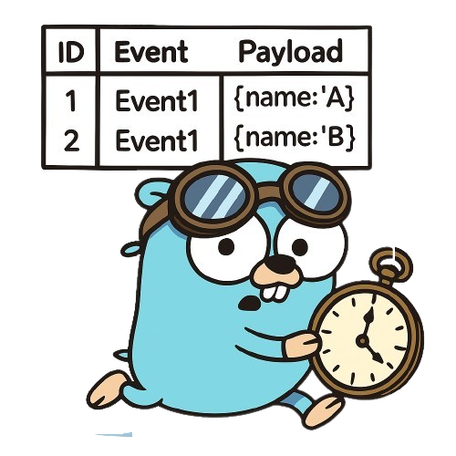

<div align="center">
    
    <h1>Chronicle</h1>
</div>

<div align="center">
  <h3 align="center">A pragmatic and type-safe toolkit for <br/>modern event sourcing in Go.</h3>
  <a href="mailto:andreisurugiu.tm@gmail.com"><i>Want to hire me?</i></a>
</div>

- [Quickstart](#quickstart)
- [What is event sourcing?](#what-is-event-sourcing)
- [Why event sourcing?](#why-event-sourcing)
- [Why not event sourcing?](#why-not-event-sourcing)
- [Optimistic Concurrency \& Conflict Errors](#optimistic-concurrency--conflict-errors)
	- [Handling conflict errors](#handling-conflict-errors)
	- [Retry with backoff](#retry-with-backoff)
	- [Custom retry](#custom-retry)
	- [How is this different from SQL transactions?](#how-is-this-different-from-sql-transactions)
	- [Will conflicts be a bottleneck?](#will-conflicts-be-a-bottleneck)
- [Snapshots](#snapshots)
	- [Snapshot strategies](#snapshot-strategies)
- [Shared event metadata](#shared-event-metadata)
- [Ordering: Event log \& Global event log](#ordering-event-log--global-event-log)
- [Storage backends](#storage-backends)
	- [Event logs](#event-logs)
	- [Snapshot stores](#snapshot-stores)
- [Event transformers](#event-transformers)
	- [Example: Crypto shedding for GDPR](#example-crypto-shedding-for-gdpr)
	- [Global Transformers with `AnyTransformerToTyped`](#global-transformers-with-anytransformertotyped)
	- [Event versioning and upcasting](#event-versioning-and-upcasting)
		- [Merging events for compaction](#merging-events-for-compaction)
- [Projections](#projections)
	- [`event.TransactionalEventLog` and `aggregate.TransactionalRepository`](#eventtransactionaleventlog-and-aggregatetransactionalrepository)
	- [Example](#example)
	- [Example with outbox](#example-with-outbox)
	- [Types of projections](#types-of-projections)
		- [By Scope](#by-scope)
		- [By Behavior](#by-behavior)
		- [By Data Transformation](#by-data-transformation)
		- [By Consistency Guarantees](#by-consistency-guarantees)
		- [By How Often You Update](#by-how-often-you-update)
		- [By Mechanism of Updating](#by-mechanism-of-updating)
- [Event deletion](#event-deletion)
	- [Event archival](#event-archival)
- [Implementing a custom `event.Log`](#implementing-a-custom-eventlog)
	- [The `event.Reader` interface](#the-eventreader-interface)
	- [The `event.Appender` interface](#the-eventappender-interface)
	- [Global Event Log (the `event.GlobalReader` interface)](#global-event-log-the-eventglobalreader-interface)
	- [Transactional Event Log](#transactional-event-log)
- [Implementing a custom `aggregate.Repository`](#implementing-a-custom-aggregaterepository)
	- [Using an `aggregate.FusedRepo`](#using-an-aggregatefusedrepo)
- [Contributing](#contributing)
	- [Devbox](#devbox)
	- [Automation](#automation)
	- [Workflow](#workflow)
- [How the codebase is structured](#how-the-codebase-is-structured)
	- [Core Packages](#core-packages)
	- [Pluggable Implementations](#pluggable-implementations)
	- [Package Dependencies](#package-dependencies)
	- [Testing](#testing)
- [Benchmarks](#benchmarks)
- [Acknowledgements](#acknowledgements)
- [TODOs \& day 2](#todos--day-2)


## Quickstart

> [!WARNING]
> I recommend going through the quickstart, since all examples use the `Account` struct used below from the `account` package.

Install the library
```sh
go get github.com/DeluxeOwl/chronicle

# for debugging
go get github.com/sanity-io/litter
```

Define your aggregate and embed `aggregate.Base`. This embedded struct handles the versioning of the aggregate for you.

We'll use a classic yet very simplified bank account example:
```go
package account

import (
	"errors"
	"fmt"
	"time"

	"github.com/DeluxeOwl/chronicle/aggregate"
	"github.com/DeluxeOwl/chronicle/event"
)

type Account struct {
	aggregate.Base
}
```

Declare a type for the aggregate's ID. This ID type **MUST** implement `fmt.Stringer`. You also need to add an `ID()` method to your aggregate that returns this ID.

```go
type AccountID string

func (a AccountID) String() string { return string(a) }

type Account struct {
	aggregate.Base

	id AccountID
}

func (a *Account) ID() AccountID {
	return a.id
}
```

Declare the event type for your aggregate using a sum type (we're also using the [go-check-sumtype](https://github.com/alecthomas/go-check-sumtype) linter that comes with [golangci-lint](https://golangci-lint.run/)) for type safety:
```go
//sumtype:decl
type AccountEvent interface {
	event.Any
	isAccountEvent()
}
```

Now declare the events that are relevant for your business domain.

The events **MUST** be side effect free (no i/o).
The event methods (`EventName`, `isAccountEvent`) **MUST** have pointer receivers:

```go
// We say an account is "opened", not "created"
type accountOpened struct {
	ID         AccountID `json:"id"`
	OpenedAt   time.Time `json:"openedAt"`
	HolderName string    `json:"holderName"`
}

func (*accountOpened) EventName() string { return "account/opened" }
func (*accountOpened) isAccountEvent()   {}
```

By default, events are serialized to JSON (this can be changed when you configure the repository).

To satisfy the `event.Any` interface (embedded in `AccountEvent`), you must add an `EventName() string` method to each event.

Let's implement two more events:

```go
type moneyDeposited struct {
	Amount int `json:"amount"` // Note: In a real-world application, you would use a dedicated money type instead of an int to avoid precision issues.
}

// ⚠️ Note: the event name is unique
func (*moneyDeposited) EventName() string { return "account/money_deposited" }
func (*moneyDeposited) isAccountEvent()   {}

type moneyWithdrawn struct {
	Amount int `json:"amount"`
}

// ⚠️ Note: the event name is unique
func (*moneyWithdrawn) EventName() string { return "account/money_withdrawn" }
func (*moneyWithdrawn) isAccountEvent()   {}
```


You must now "bind" these events to the aggregate by providing a constructor function for each one. This allows the library to correctly deserialize events from the event log back into their concrete types.

You need to make sure to create a constructor function for each event:

```go
func (a *Account) EventFuncs() event.FuncsFor[AccountEvent] {
	return event.FuncsFor[AccountEvent]{
		func() AccountEvent { return new(accountOpened) },
		func() AccountEvent { return new(moneyDeposited) },
		func() AccountEvent { return new(moneyWithdrawn) },
	}
}
```

Let's go back to the aggregate, and define the fields relevant to our business domain (these fields will be populated when we replay the events):
```go
type Account struct {
	aggregate.Base

	id AccountID

	openedAt   time.Time
	balance    int // we need to know how much money an account has
	holderName string
}
```

Now we need a way to build the aggregate's state from its history of events. This is done by "replaying" or "applying" the events to the aggregate.
You shouldn't check business logic rules here, you should just recompute the state of the aggregate.

We'll enforce business rules in commands. 

Note that the event structs themselves are unexported. All external interaction with the aggregate should be done via commands, which in turn generate and record events.

```go
func (a *Account) Apply(evt AccountEvent) error {
	switch event := evt.(type) {
	case *accountOpened:
		a.id = event.ID
		a.openedAt = event.OpenedAt
		a.holderName = event.HolderName
	case *moneyWithdrawn:
		a.balance -= event.Amount
	case *moneyDeposited:
		a.balance += event.Amount
	default:
		return fmt.Errorf("unexpected event kind: %T", event)
	}
	return nil
}
```

This is type safe with the `gochecksumtype` linter.

If you didn't add any cases, you'd get a linter error:
```
exhaustiveness check failed for sum type "AccountEvent" (from account.go:24:6): missing cases for accountOpened, moneyDeposited, moneyWithdrawn (gochecksumtype)
```

Now, let's actually interact with the aggregate: what can we do with it? what are the **business operations** (commands)?

We can **open an account**, **deposit money** and **withdraw money**.

Let's start with opening an account. This will be a "factory function" that creates and initializes our aggregate.

First, we define a function that returns an empty aggregate, we'll need it later and in the constructor:
```go
func NewEmpty() *Account {
	return new(Account)
}
```

And now, opening an account, and let's say **you can't open an account on a Sunday** (as an example of a business rule):
```go
func Open(id AccountID, currentTime time.Time) (*Account, error) {
	if currentTime.Weekday() == time.Sunday {
		return nil, errors.New("sorry, you can't open an account on Sunday ¯\\_(ツ)_/¯")
	}
	// ...
}
```

We need a way to "record" this event, for that, we declare a helper, unexported method that uses `RecordEvent` from the `aggregate` package:
```go
func (a *Account) recordThat(event AccountEvent) error {
	return aggregate.RecordEvent(a, event)
}
```

Getting back to `Open`, recording an event is now straightforward:
```go
func Open(id AccountID, currentTime time.Time) (*Account, error) {
	if currentTime.Weekday() == time.Sunday {
		return nil, errors.New("sorry, you can't open an account on Sunday ¯\\_(ツ)_/¯")
	}

	a := NewEmpty()

	// Note: this is type safe, you'll get autocomplete for the events
	if err := a.recordThat(&accountOpened{
		ID:         id,
		OpenedAt:   currentTime,
		HolderName: holderName,
	}); err != nil {
		return nil, fmt.Errorf("open account: %w", err)
	}

	return a, nil
}
```

Let's add the other commands for our domain methods - I usually enforce business rules here:
```go
func (a *Account) DepositMoney(amount int) error {
	if amount <= 0 {
		return errors.New("amount must be greater than 0")
	}

	return a.recordThat(&moneyDeposited{
		Amount: amount,
	})
}
```

And withdrawing money:
```go
// Returns the amount withdrawn and an error if any
func (a *Account) WithdrawMoney(amount int) (int, error) {
	if a.balance < amount {
		return 0, fmt.Errorf("insufficient money, balance left: %d", a.balance)
	}

	err := a.recordThat(&moneyWithdrawn{
		Amount: amount,
	})
	if err != nil {
		return 0, fmt.Errorf("error during withdrawal: %w", err)
	}

	return amount, nil
}
```

That's it, it's time to wire everything up.

We start by creating an event log. For this example, we'll use a simple in-memory log, but other implementations (sqlite, postgres etc.) are available.
```go
package main

import (
	"context"
	"fmt"
	"time"

	"github.com/DeluxeOwl/chronicle"
	"github.com/DeluxeOwl/chronicle/eventlog"
	"github.com/DeluxeOwl/chronicle/examples/internal/account"
	"github.com/sanity-io/litter"
)

func main() {
	// Create a memory event log
	memoryEventLog := eventlog.NewMemory()
	//...
}
```

We continue by creating the repository for the accounts:
```go
	accountRepo, err := chronicle.NewEventSourcedRepository(
		memoryEventLog,  // The event log
		account.NewEmpty, // The constructor for our aggregate
		nil,             // This is an optional parameter called "transformers"
	)
	if err != nil {
		panic(err)
	}
```

We create the account and interact with it
```go
	// Create an account
	acc, err := account.Open(AccountID("123"), time.Now(), "John Smith")
	if err != nil {
		panic(err)
	}
	
	// Deposit some money
	err = acc.DepositMoney(200)
	if err != nil {
		panic(err)
	}
	
	// Withdraw some money
	_, err = acc.WithdrawMoney(50)
	if err != nil {
		panic(err)
	}
```

And we use the repo to save the account:
```go
	ctx := context.Background()
	version, committedEvents, err := accountRepo.Save(ctx, acc)
	if err != nil {
		panic(err)
	}
```

The repository returns the new version of the aggregate, the list of committed events, and an error if one occurred. The version is also updated on the aggregate instance itself and can be accessed via `acc.Version()` (this is handled by `aggregate.Base`)

An aggregate starts at version 0. The version is incremented for each new event that is recorded.

Printing these values gives:
```go
	fmt.Printf("version: %d\n", version)
	for _, ev := range committedEvents {
		litter.Dump(ev)
	}
```

```go
❯ go run examples/1_quickstart/main.go
version: 3
&main.accountOpened{
  ID: "123",
  OpenedAt: time.Time{}, // Note: litter omits private fields for brevity
  HolderName: "John Smith",
}
&main.moneyDeposited{
  Amount: 200,
}
&main.moneyWithdrawn{
  Amount: 50,
}
```

You can find this example in [./examples/1_quickstart](./examples/1_quickstart).
You can find the implementation of the account in [./examples/internal/account/account.go](./examples/internal/account/account.go).

**Note:** you will see an additional `accountv2` package that is 95% identical to the `account` package + shared event metadata. You can ignore this package as most examples assume the `account` package. You can find more info in the [Shared event metadata section](https://github.com/DeluxeOwl/chronicle?tab=readme-ov-file#shared-event-metadata).

## What is event sourcing?

Event sourcing is a pattern for storing all changes to an application's state as a sequence of *immutable* "**events**".

The current state can be rebuilt from these events, treating the sequence ("**event log**") as the single source of truth.

You can only add new events to the event log; you can never change or delete existing ones.

For example, instead of storing a person's information in a conventional database table (like in PostgreSQL or SQLite):

| id | name | age |
| :--- | :--- | :-: |
| 7d7e974e | John Smith | 2 |
| 44bcdbc3 | Lisa Doe | 44 |

We store a sequence of events in an event log:

| log_id | version | event_name | event_data |
| :--- | :--- | :--- | :--- |
| **person/7d7e974e** | **1** | **person/was_born** | **{"name": "John Smith"}** |
| **person/7d7e974e** | **2** | **person/aged_one_year** | **{}** |
| person/44bcdbc3 | 1 | person/was_born | {"name": "Lisa Doe"} |
| **person/7d7e974e** | **3** | **person/aged_one_year** | **{}** |
| person/44bcdbc3 | 2 | person/aged_one_year | {} |
| ... | ... | ... | ... |

By **applying** (or replaying) these events in order for a, we can reconstruct the current state of any person.

In the example above, you would apply all events with the log ID `person/7d7e974e` (the bold rows), ordered by `version`, to reconstruct the current state for "John Smith".

Let's take a simplified bank account example with the balance stored in an db table:

| id | balance |
| :--- | :--- |
| 162accc9 | $150 |

With this model, if you see the balance is $150, you have no idea *how* it got there. The history is lost.

With event sourcing, the event log would instead store a list of all transactions:

| log_id | version | event_name | event_data |
| :--- | :--- | :--- | :--- |
| account/162accc9 | 1 | account/created | {} |
| account/162accc9 | 2 | account/money_deposited | {"amount": "$200"} |
| account/162accc9 | 3 | account/money_withdrawn | {"amount": "$50"} |

Events are organized per log id (**also called an aggregate id**). In the examples above, you have events **per** person (`person/7d7e974e` and `person/44bcdbc3`) and **per** account (`account/162accc9`).


Events are facts: they describe *something* that happened in the past and should be named in the past tense:
```
person/was_born
person/aged_one_year
account/money_deposited
account/money_withdrawn
```

You might wonder, "What if the user wants to see how many people are named 'John'?" You'd have to replay ALL events for ALL people and count how many have the name "John".

That would be inefficient. This is why **projections** exist.

Projections are specialized **read** models, optimized for querying. They are built by listening to the stream of events as they happen.

Examples of projections:
- How many people are named john
- The people aged 30 to 40
- How much money was withdrawn per day for the past 30 days


Projections can be stored in many different ways, **usually separate** from the event log store itself:
- In a database table you can query with SQL
- In an in-memory database like Redis
- In a search engine like Elasticsearch
- Or simply in the application's memory

For example, let's create a projection that counts people named "John". Our projector is only interested in one event: `person/was_born`. It will ignore all others.

Here’s how the projector builds the read model by processing events from the log one by one:

| Incoming Event | Listener's Action | Projection State (our read model) |
| :--- | :--- | :--- |
| *(initial state)* | | `{ "john_count": 0 }` |
| `person/was_born` `{"name": "John Smith"}` | Name starts with "John". `john_count` is incremented. | `{ "john_count": 1 }` |
| `person/aged_one_year` `{}` | Irrelevant event for this projection. State is unchanged. | `{ "john_count": 1 }` |
| `person/was_born` `{"name": "Lisa Doe"}` | Name does not start with "John". State is unchanged. | `{ "john_count": 1 }` |
| `person/was_born` `{"name": "John Doe"}` | Name starts with "John". `john_count` is incremented. | `{ "john_count": 2 }` |
| `person/aged_one_year` `{}` | Irrelevant event for this projection. State is unchanged. | `{ "john_count": 2 }` |
| `person/was_born` `{"name": "Peter Jones"}` | Name does not start with "John". State is unchanged. | `{ "john_count": 2 }` |

The final result is a projection - a simple read model that's fast to query. 
It could be stored in a key-value store like Redis, or a simple db table:

**Table: `name_counts`**

| name_search | person_count |
| :--- | :--- |
| john | 2 |
| lisa | 1 |
| peter | 1 |

Now, when the end user asks, "How many people are named John?", you don't need to scan the entire event log. You simply query your projection, which gives you the answer instantly.

The event log is the source of truth, so projections can be rebuilt from it at any time. However, projections are usually updated *after* an event is written, which means they can briefly lag behind the state in the event log. This is known as **eventual consistency**.

This pattern plays well with Command Query Responsibility Segregation, or CQRS for short:
- **Commands** write to the event log.
- **Queries** read from projections.

## Why event sourcing?

> [*"Every system is a log"*](https://news.ycombinator.com/item?id=42813049)

Here are some of the most common benefits cited for event sourcing:
- **Auditing**: You have a complete, unchangeable record of every action that has occurred in your application.
- **Time Travel**: You can reconstruct the state of your application at any point in time.
- **Read/Write Separation**: You can create new read models for new use cases at any time by replaying the event log, without impacting the write side.
- **Scalability**: You can scale the read and write sides of your application independently.
- **Simple integration**: Other systems can subscribe to the event stream.

But the main benefit I agree with comes from [this event-driven.io article](https://event-driven.io/en/dealing_with_eventual_consistency_and_idempotency_in_mongodb_projections/), paraphrasing:
> Event sourcing helps you first model *what happens* (the events), and **then** worry about how to interpret that data using projections.

The event log is a very powerful primitive, from [every system is a log](https://restate.dev/blog/every-system-is-a-log-avoiding-coordination-in-distributed-applications/) (I highly recommend reading this article and discussion on HN to get a better idea why a log is useful):
- Message queues are logs: Apache Kafka, Pulsar, Meta’s Scribe are distributed implementations of the log abstraction. 
- Databases (and K/V stores) are logs: changes go to the write-ahead-log first, then get materialized into the tables.

## Why not event sourcing?

Adopting event sourcing is a significant architectural decision; it tends to influence the entire structure of your application (some might say it "infects" it).

In many applications, the current state of the data is all that matters.

Reasons **NOT** to use event sourcing:
- **It can be massive overkill.** For simple CRUD applications without complex business rules, the current state of the data is often all that matters.
    - For example, if your events are just `PersonCreated`, `PersonUpdated`, and `PersonDeleted`, you should seriously consider avoiding event sourcing.
- **You don't want to deal with eventual consistency.** If your application requires immediate, strong consistency between writes and reads, event sourcing adds complexity.
- **Some constraints are harder to enforce.**
    - e.g. requiring unique usernames, see TODO
- **Data deletion and privacy require complex workarounds.**
    - e.g. the event log being immutable makes it hard to implement GDPR compliance, requiring things like [crypto shedding (see below)](https://github.com/DeluxeOwl/chronicle?tab=readme-ov-file#example-crypto-shedding-for-gdpr).
- **It has a high learning curve.** Most developers are not familiar with this pattern.
    - Forcing it on an unprepared team can lead to slower development and team friction.
- **You cannot directly query the current state;** you must build and rely on projections for all queries.
- **It often requires additional infrastructure,** such as a message queue (e.g., NATS, Amazon SQS, Kafka) to process events and update projections reliably.

## Optimistic Concurrency & Conflict Errors

You can find this example in [./examples/2_optimistic_concurrency/main.go](./examples/2_optimistic_concurrency/main.go).

What happens if two users try to withdraw money from the same bank account at the exact same time? This is called a "race condition" problem.

Event sourcing handles this using **Optimistic Concurrency Control**. 

`chronicle` handles this for you automatically thanks to the versioning system built into `aggregate.Base` - the struct you embed in your aggregates.

We're gonna use the `Account` example from the `examples/internal/account` package (check the quickstart if you haven't done so).

We're gonna open an account and deposit some money
```go
	acc, _ := account.Open(accID, time.Now(), "John Smith")
	_ = acc.DepositMoney(200) // balance: 200

	_, _, _ = accountRepo.Save(ctx, acc)
	fmt.Printf("Initial account saved. Balance: 200, Version: %d\n\n", acc.Version())
```

The account starts at version 0, `Open` is event 1, `Deposit` is event 2.
After saving, the version will be 2.

Then, we assume two users load the same account at the same time:
```go
	accUserA, _ := accountRepo.Get(ctx, accID)
	fmt.Printf("User A loads account. Version: %d, Balance: %d\n", accUserA.Version(), accUserA.Balance())
	// User A loads account. Version: 2, Balance: 200

	accUserB, _ := accountRepo.Get(ctx, accID)
	fmt.Printf("User B loads account. Version: %d, Balance: %d\n\n", accUserB.Version(), accUserB.Balance())
	// User B loads account. Version: 2, Balance: 200
```

User B tries to withdraw $50:
```go
	_, _ = accUserB.WithdrawMoney(50)
	_, _, _ = accountRepo.Save(ctx, accUserB)
	fmt.Printf("User B withdraws $50 and saves. Account is now at version %d\n", accUserB.Version())
```

User B withdraws $50 and **saves**. Account is now at version 3.

At the **same time**, User A tried to withdraw $100. The business logic passes because their copy of the account *thinks* the balance is still $200.

```go
	_, _ = accUserA.WithdrawMoney(100)
	fmt.Println("User A tries to withdraw $100 and save...")
```

User A tries to save:
```go
	_, _, err := accountRepo.Save(ctx, accUserA)
	if err != nil {
		var conflictErr *version.ConflictError
		if errors.As(err, &conflictErr) {
			fmt.Println("\n💥 Oh no! A conflict error occurred!")
			fmt.Printf("   User A's save failed because it expected version %d, but the actual version was %d.\n",
				conflictErr.Expected, conflictErr.Actual)
		} else {
			// Other save errors
			panic(err)
		}
	}
```

And we get a **conflict error**: `User A's save failed because it expected version 2, but the actual version was 3.`

### Handling conflict errors

How do you handle the error above? The most common way is to **retry the command**:
1. Re-load the aggregate from the repository to get the absolute latest state and version
2. Re-run the original command
3. Try to Save again

```go
	// 💥 Oh no! A conflict error occurred!
	//...
	//... try to withdraw again
	accUserA, _ = accountRepo.Get(ctx, accID)
	_, err = accUserA.WithdrawMoney(100)
	if err != nil {
		panic(err)
	}

	fmt.Println("User A tries to withdraw $100 and save...")
	version, _, err := accountRepo.Save(ctx, accUserA)
	if err != nil {
		panic(err)
	}
	fmt.Printf("User A saved successfully! Version is %d and balance $%d\n", version, accUserA.Balance())
	// User A saved successfully! Version is 4 and balance $50
```


### Retry with backoff
The retry cycle can be handled in a loop. If the conflicts are frequent, you might add a backoff.

You can wrap the repository with `chronicle.NewEventSourcedRepositoryWithRetry`, which uses github.com/avast/retry-go/v4 for retries. 

**The default is to retry 3 times on conflict errors**. You can customize the retry mechanism by providing `retry.Option(s)`.

```go
	import "github.com/avast/retry-go/v4"

	ar, _ := chronicle.NewEventSourcedRepository(
		memoryEventLog,
		account.NewEmpty,
		nil,
	)

	accountRepo := chronicle.NewEventSourcedRepositoryWithRetry(ar)
	
	accountRepo := chronicle.NewEventSourcedRepositoryWithRetry(ar, retry.Attempts(5),
		retry.Delay(100*time.Millisecond),    // Initial delay
		retry.MaxDelay(10*time.Second),       // Cap the maximum delay
		retry.DelayType(retry.BackOffDelay),  // Exponential backoff
		retry.MaxJitter(50*time.Millisecond), // Add randomness
	)
```

### Custom retry

Example of wrapping a repository with a custom `Save` method with retries:

```go
type SaveResult struct {
	Version         version.Version
	CommittedEvents aggregate.CommittedEvents[account.AccountEvent]
}

type SaverWithRetry struct {
	saver aggregate.Saver[account.AccountID, account.AccountEvent, *account.Account]
}

func (s *SaverWithRetry) Save(ctx context.Context, root *account.Account) (version.Version, aggregate.CommittedEvents[account.AccountEvent], error) {
	result, err := retry.DoWithData(
		func() (SaveResult, error) {
			version, committedEvents, err := s.saver.Save(ctx, root)
			if err != nil {
				return SaveResult{}, err
			}
			return SaveResult{
				Version:         version,
				CommittedEvents: committedEvents,
			}, nil
		},
		retry.Attempts(3),
		retry.Context(ctx),
		retry.RetryIf(func(err error) bool {
			// Only retry on ConflictErr or specific errors
			var conflictErr *version.ConflictError
			return errors.As(err, &conflictErr)
		}),
	)
	if err != nil {
		var zero version.Version
		var zeroCE aggregate.CommittedEvents[account.AccountEvent]
		return zero, zeroCE, err
	}

	return result.Version, result.CommittedEvents, nil
}
// ...
	accountRepo, _ := chronicle.NewEventSourcedRepository(
		memoryEventLog,
		account.NewEmpty,
		nil,
	)

	repoWithRetry := &aggregate.FusedRepo[account.AccountID, account.AccountEvent, *account.Account]{
		AggregateLoader: accountRepo,
		VersionedGetter: accountRepo,
		Getter:          accountRepo,
		Saver: &SaverWithRetry{
			saver: accountRepo,
		},
	}
```


### How is this different from SQL transactions?

SQL transactions often use **pessimistic locking** - which means you assume a conflict is likely and you lock the data upfront to prevent it:

1. **`BEGIN TRANSACTION;`**: Start a database transaction.
2. **`SELECT balance FROM accounts WHERE id = 'acc-123' FOR UPDATE;`**: This is the critical step. The `FOR UPDATE` clause tells the database to place a **write lock** on the selected row.
3. While this lock is held, no other transaction can read that row with `FOR UPDATE` or write to it. Any other process trying to do so will be **blocked** and forced to wait until the first transaction is finished.
4. The application code checks if `balance >= amount_to_withdraw`.
5. **`UPDATE accounts SET balance = balance - 50 WHERE id = 'acc-123';`**: The balance is updated.
6. **`COMMIT;`**: The transaction is committed, and the lock on the row is released.

In this model, a race condition like the one in our example is impossible. User B's transaction would simply pause at step 2, waiting for User A's transaction to `COMMIT` or `ROLLBACK`. 

The database itself serializes the access. 

In **optimistic concurrency control** - we shift the responsability from out database to our application.

### Will conflicts be a bottleneck?

A common question is: "Will my app constantly handle conflict errors and retries? Won't that be a bottleneck?".

With well designed aggregates, the answer is **no**. Conflicts are the exception, not the rule.

The most important thing to remember is that version conflicts happen **per aggregate**. 

A `version.ConflictError` for `AccountID("acc-123")` has absolutely no effect on a concurrent operation for `AccountID("acc-456")`. The aggregate itself defines the consistency boundary.

Because aggregates are typically designed to represent a single, cohesive entity that is most often manipulated by a single user at a time (like _your_ shopping cart, or _your_ user profile), the opportunity for conflicts is naturally low. 

This fine-grained concurrency model is what allows event-sourced systems to achieve high throughput, as the vast majority of operations on different aggregates can proceed in parallel without any contention.

## Snapshots

You can find this example in [./examples/3_snapshots/main.go](./examples/3_snapshots/main.go) and [(./examples/internal/account/account_snapshot.go](./examples/internal/account/account_snapshot.go).

During the lifecycle of an application, some aggregates might accumulate a very long list of events.

For example, an account could exist for decades and accumulate thousands or even tens of thousands of transactions.

Loading such an aggregate would require fetching and replaying its entire history from the beginning, which could become a performance bottleneck. (As a rule of thumb, always measure first-loading even a few thousand events is often perfectly acceptable performance-wise).

Snapshots are a performance optimization that solves this problem. 

A snapshot is a serialized copy of an aggregate's state at a specific version. Instead of replaying the entire event history, the system can load the *latest snapshot* and then replay only the events that have occurred _since_ that snapshot was taken.

Let's continue our `Account` example from the quickstart and add snapshot functionality. 

First we need to create our snapshot struct which needs to satisfy the interface `aggregate.Snapshot[TID]` (by implementing `ID() AccountID` and `Version() version.Version`). 

This means it must store the aggregate's ID and version, which are then exposed via the required `ID()` and `Version()` methods.

```go
package account

type Snapshot struct {
	AccountID        AccountID       `json:"id"`
	OpenedAt         time.Time       `json:"openedAt"`
	Balance          int             `json:"balance"`
	HolderName       string          `json:"holderName"`
	AggregateVersion version.Version `json:"version"`
}

func (s *Snapshot) ID() AccountID {
	return s.AccountID
}

func (s *Snapshot) Version() version.Version {
	return s.AggregateVersion
}
```

It's a "snapshot" (a point in time picture) of the `Account`'s state at a given point that can be serialized (JSON by default).

Next, we need a way to convert an `Account` aggregate to an `AccountSnapshot` and back. This is the job of a `Snapshotter`. It acts as a bridge between your live aggregate and its serialized snapshot representation.

We create a type that implements the `aggregate.Snapshotter` interface.

```go
package account

type Snapshotter struct{}

func (s *Snapshotter) ToSnapshot(acc *Account) (*Snapshot, error) {
	return &Snapshot{
		AccountID:        acc.ID(), // Important: save the aggregate's id
		OpenedAt:         acc.openedAt,
		Balance:          acc.balance,
		HolderName:       acc.holderName,
		AggregateVersion: acc.Version(), // Important: save the aggregate's version
	}, nil
}

func (s *Snapshotter) FromSnapshot(snap *Snapshot) (*Account, error) {
	// Recreate the aggregate from the snapshot's data
	acc := NewEmpty()
	acc.id = snap.ID()
	acc.openedAt = snap.OpenedAt
	acc.balance = snap.Balance
	acc.holderName = snap.HolderName

	// ⚠️ The repository will set the correct version on the aggregate's Base
	return acc, nil
}
```

The `ToSnapshot` method captures the current state, and `FromSnapshot` restores it. 

Note that `FromSnapshot` doesn't need to set the version on the aggregate's embedded `Base`; the framework handles this automatically when loading from a snapshot.


Let's wire everything up in `main`:
```go
package main

import (
	"context"
	"fmt"
	"time"

	"github.com/DeluxeOwl/chronicle"
	"github.com/DeluxeOwl/chronicle/eventlog"
	"github.com/DeluxeOwl/chronicle/examples/internal/account"
	"github.com/DeluxeOwl/chronicle/snapshotstore"
)

func main() {
	memoryEventLog := eventlog.NewMemory()
	baseRepo, _ := chronicle.NewEventSourcedRepository(
		memoryEventLog,
		account.NewEmpty,
		nil,
	)

	accountSnapshotStore := snapshotstore.NewMemoryStore(
		func() *account.Snapshot { return new(account.Snapshot) },
	)
	// ...
}
```

We create a snapshot store for our snapshots. It needs a constructor for an empty snapshot, used for deserialization.

While the library provides an in-memory snapshot store out of the box, the `aggregate.SnapshotStore` interface makes it straightforward to implement your own persistent store (e.g., using a database table, Redis, or a file-based store).

Then, we wrap the base repository with the snapshotting functionality. 

Now, we need to decide _when_ to take a snapshot. You probably don't want to create one on every single change, as that would be inefficient. The framework provides a flexible `SnapshotStrategy` to define this policy and a builder for various strategies:
```go
	accountSnapshotStore := snapshotstore.NewMemoryStore(
		func() *account.Snapshot { return new(account.Snapshot) },
	)

	accountRepo, err := chronicle.NewEventSourcedRepositoryWithSnapshots(
		baseRepo,
		accountSnapshotStore,
		&account.Snapshotter{},
		aggregate.SnapStrategyFor[*account.Account]().EveryNEvents(3),
	)
	if err != nil {
		panic(err)
	}
```

In our example, we chose to snapshot every 3 events.

Let's issue some commands:
```go
	ctx := context.Background()
	accID := account.AccountID("snap-123")

	acc, err := account.Open(accID, time.Now(), "John Smith") // version 1
	if err != nil {
		panic(err)
	}
	_ = acc.DepositMoney(100) // version 2
	_ = acc.DepositMoney(100) // version 3
	
	// Saving the aggregate with 3 uncommitted events.
	// The new version will be 3.
	// Since 3 >= 3 (our N), the strategy will trigger a snapshot.
	_, _, err = accountRepo.Save(ctx, acc)
	if err != nil {
		panic(err)
	}
```

The repository loads the snapshot at version 3. Then, it will ask the event log for events for "snap-123" starting from version 4. Since there are none, loading is complete, and very fast.

```go
	reloadedAcc, err := accountRepo.Get(ctx, accID)
	if err != nil {
		panic(err)
	}

	fmt.Printf("Loaded account from snapshot. Version: %d\n", reloadedAcc.Version())
	// Loaded account from snapshot. Version: 3
```

We can also get the snapshot from the store to check:
```go
	snap, found, err := accountSnapshotStore.GetSnapshot(ctx, accID)
	if err != nil {
		panic(err)
	}
	fmt.Printf("Found snapshot: %t: %+v\n", found, snap)
	// Found snapshot: true: &{AccountID:snap-123 OpenedAt:2025-08-25 10:53:57.970965 +0300 EEST Balance:200 HolderName:John Smith AggregateVersion:3}
```

### Snapshot strategies
If you type `aggregate.SnapStrategyFor[*account.Account]().` you will get autocomplete for various snapshot strategies:
- `EveryNEvents(n)`: Takes a snapshot every n times the aggregate is saved.
- `AfterCommit()`: Takes a snapshot after every successful save.
- `OnEvents(eventNames...)`: Takes a snapshot only if one or more of the specified event types were part of the save.
- `AllOf(strategies...)`: A composite strategy that triggers only if all of its child strategies match.
- `AnyOf(strategies...)`: A composite strategy that triggers if any of its child strategies match.     

Or a `Custom(...)` strategy, which gives you complete control by allowing you to provide your own function. This function receives the aggregate's state, its versions, and the list of committed events, so you can decide when a snapshot should be taken:
```go
aggregate.SnapStrategyFor[*account.Account]().Custom(
			func(ctx context.Context, root *account.Account, previousVersion, newVersion version.Version, committedEvents aggregate.CommittedEvents[account.AccountEvent]) bool {
				return true // always snapshot
			}),
```

An example in [account_snapshot.go](./examples/internal/account/account_snapshot.go):
```go
func CustomSnapshot(
	ctx context.Context,
	root *Account,
	_, _ version.Version,
	_ aggregate.CommittedEvents[AccountEvent],
) bool {
	return root.balance%250 == 0 // Only snapshot if the balance is a multiple of 250
}
```

**Important**: Regardless of the snapshot strategy chosen, saving the snapshot happens after the new events are successfully committed to the event log. This means the two operations are not atomic. It is possible for the events to be saved successfully but for the subsequent snapshot save to fail. 

By default, an error during a snapshot save will be returned by the Save method. You can customize this behavior with the `aggregate.OnSnapshotError` option, allowing you to log the error and continue, or ignore it entirely.

Since snapshots are purely a performance optimization, ignoring a failed snapshot save can be a safe and reasonable strategy. The aggregate can always be rebuilt from the event log, which remains the single source of truth.

## Shared event metadata

You can find this example in [./examples/5_event_metadata](./examples/5_event_metadata/main.go), [./examples/internal/shared](./examples/internal/shared/event.go) and [./examples/internal/accountv2](./examples/internal/accountv2/).

You might be interested in sharing some fields between events: a timestamp, an event id, correlation ids, some authorization data (like who triggered an event) etc.

This kind of data is very useful for projections: like getting the events in the past 30 days.

Technically you could add this metadata at the `event.Log` layer, but I prefer adding it at the application layer.

We want our events to have the following: a unique id and a timestamp.
For that, we're going to create a shared event that must be embedded by our `AccountEvent`(s).

```go
// in examples/internal/shared/event.go
package shared

type EventMeta interface {
	isEventMeta()
}

type EventMetadata struct {
	EventID   string    `json:"eventID"`
	OccuredAt time.Time `json:"occuredAt"`
}

func (em *EventMetadata) isEventMeta() {}
```

We're going to use the `EventMeta` sealed interface as our compile-time check to remind us to embed the metadata.

We'll create a constructor that will generate `EventMetadata` for us:
```go
func NewEventMetaGenerator(provider timeutils.TimeProvider) *EventMetaGenerator {
	return &EventMetaGenerator{
		gen: func() EventMetadata {
			now := provider.Now()

			return EventMetadata{
				// The uuidv7 contains the timestamp
				EventID: uuid.Must(uuid.NewV7AtTime(now)).String(),
				// Or just same a simple timestamp
				OccuredAt: now,
			}
		},
	}
}

type EventMetaGenerator struct {
	gen func() EventMetadata
}

func (gen *EventMetaGenerator) NewEventMeta() EventMetadata {
	return gen.gen()
}
```

Wait, what's that `timeutils.TimeProvider` type? That type is an interface which helps us mock the time for testing purposes:
```go
package timeutils

import "time"

//go:generate go run github.com/matryer/moq@latest -pkg timeutils -skip-ensure -rm -out now_mock.go . TimeProvider
type TimeProvider interface {
	Now() time.Time
}

var RealTimeProvider = sync.OnceValue(func() *realTimeProvider {
	return &realTimeProvider{}
})

type realTimeProvider struct{}

func (r *realTimeProvider) Now() time.Time {
	return time.Now()
}
```

Moving on, we're going to wire this event metadata into our account. We've created a new package called `accountv2` that we're going to extend with the metadata.

Let's add our `shared.EventMeta` interface to our `AccountEvent`
```go
//sumtype:decl
type AccountEvent interface {
	event.Any
	shared.EventMeta
	isAccountEvent()
}
```

We're gonna get some compiler errors:
```
cannot use new(accountOpened) (value of type *accountOpened) as AccountEvent value in return statement: *accountOpened does not implement AccountEvent (missing method isEventMeta)
```

These errors tell use that we're missing the method `isEventMeta()`, a method that is only satisfied by the `shared.EventMetadata` struct.
This acts as our compile-time check, telling us that we must embed the `shared.EventMetadata` struct to our events.

```go
type accountOpened struct {
	shared.EventMetadata
	ID         AccountID `json:"id"`
	OpenedAt   time.Time `json:"openedAt"`
	HolderName string    `json:"holderName"`
}
// ...
type moneyDeposited struct {
	shared.EventMetadata
	Amount int `json:"amount"`
}
// ...
type moneyWithdrawn struct {
	shared.EventMetadata
	Amount int `json:"amount"`
}
```

Now we've got the `exhaustruct` linter complaining:
```go
func Open(id AccountID, currentTime time.Time, holderName string) (*Account, error) {
	if currentTime.Weekday() == time.Sunday {
		return nil, errors.New("sorry, you can't open an account on Sunday ¯\\_(ツ)_/¯")
	}

	a := NewEmpty()

	// ⚠️ accountv2.accountOpened is missing field EventMetadata (exhaustruct)
	if err := a.recordThat(&accountOpened{
		ID:         id,
		OpenedAt:   currentTime,
		HolderName: holderName,
	}); err != nil {
		return nil, fmt.Errorf("open account: %w", err)
	}

	return a, nil
}
```

We have to modify our code a bit, we're not going to pass the `currentTime` to our `Open(...)` function, instead we'll pass a `timeutils.TimeProvider`.

Some purists might say that this pollutes our domain model, but I believe injecting some dependencies is a pragmatic approach that helps us with testing.
```go
type Account struct {
	aggregate.Base
	// ...

	// technical dependencies
	timeProvider  timeutils.TimeProvider
	metaGenerator *shared.EventMetaGenerator
}

func Open(id AccountID, timeProvider timeutils.TimeProvider, holderName string) (*Account, error) {
	// ...
}
```

We also have to change our empty constructor (the one used by the repositories) to account for these technical dependencies:
```go
// From this

func NewEmpty() *Account {
	return new(Account)
}

// To this
func NewEmptyMaker(timeProvider timeutils.TimeProvider) func() *Account {
	return func() *Account {
		return &Account{
			timeProvider:  timeProvider,
			metaGenerator: shared.NewEventMetaGenerator(timeProvider),
		}
	}
}
```

We have to return a `func() *Account` since repositories expect this type.

Adding this to our `Open(...)` function and using the generator to generate the metadata:
```go
func Open(id AccountID, timeProvider timeutils.TimeProvider, holderName string) (*Account, error) {
	makeEmptyAccount := NewEmptyMaker(timeProvider) // Create the maker with the dependencies
	a := makeEmptyAccount()

	currentTime := a.timeProvider.Now()

	if currentTime.Weekday() == time.Sunday {
		return nil, errors.New("sorry, you can't open an account on Sunday ¯\\_(ツ)_/¯")
	}

	if err := a.recordThat(&accountOpened{
		ID:            id,
		OpenedAt:      currentTime,
		HolderName:    holderName,
		EventMetadata: a.metaGenerator.NewEventMeta(), // We're using the generator to generate the metadata
	}); err != nil {
		return nil, fmt.Errorf("open account: %w", err)
	}

	return a, nil
}
```

Let's update the other places where we're generating events:
```go
err := a.recordThat(&moneyWithdrawn{
		Amount:        amount,
		EventMetadata: a.metaGenerator.NewEventMeta(),
	})
// ...
return a.recordThat(&moneyDeposited{
		Amount:        amount,
		EventMetadata: a.metaGenerator.NewEventMeta(),
	})
```

Our compiler is complaining that it doesn't find the old `NewEmpty` function in the snapshot:
```go
func (s *Snapshotter) FromSnapshot(snap *Snapshot) (*Account, error) {
	acc := NewEmpty() // ⚠️ Not found
	acc.id = snap.ID()
	acc.openedAt = snap.OpenedAt
	// ...
	return acc, nil
}
```

The way to fix this is to provide the same time provider dependency to the `Snapshotter`:
```go
type Snapshotter struct {
	TimeProvider timeutils.TimeProvider
}

func (s *Snapshotter) FromSnapshot(snap *Snapshot) (*Account, error) {
	// Recreate the aggregate from the snapshot's data
	acc := NewEmptyMaker(s.TimeProvider)() // ✅ Create the maker and call it
	acc.id = snap.ID()
	// ...
}
```

We're going to use the snapshot example but adapt it to account for our shared metadata. You can find this in [examples/5_event_metadata](./examples/5_event_metadata/main.go).

We're gonna use a mocked time, generating the current time and setting the year to 2100 (we're in 2100 baby).
```go
func main() {
	memoryEventLog := eventlog.NewMemory()

	// We're using a mock time provider, generating the current time but setting the year to 2100
	timeProvider := &timeutils.TimeProviderMock{
		NowFunc: func() time.Time {
			now := time.Now()

			futureTime := now.AddDate(2100-now.Year(), 0, 0)

			return futureTime
		},
	}
	accountMaker := accountv2.NewEmptyMaker(timeProvider) // Create the maker

	baseRepo, _ := chronicle.NewEventSourcedRepository(
		memoryEventLog,
		accountMaker, // Pass it into the repo
		nil,
	)
	// ...
}
```

It's really important to pass the same `timeProvider` to the snapshotter:
```go
	accountRepo, err := chronicle.NewEventSourcedRepositoryWithSnapshots(
			baseRepo,
			accountSnapshotStore,
			&accountv2.Snapshotter{
				TimeProvider: timeProvider, // ⚠️ The same timeProvider
			},
			aggregate.SnapStrategyFor[*accountv2.Account]().EveryNEvents(3),
		)
```

And in our `accountv2.Open`:
```go
	acc, err := accountv2.Open(accID, timeProvider, "John Smith") // ⚠️ The same timeProvider
	// ...
	// Print the events
	for ev := range memoryEventLog.ReadAllEvents(ctx, version.SelectFromBeginning) {
		fmt.Println(ev.EventName() + " " + string(ev.Data()))
	}
```

Running the example:
```bash
go run examples/5_event_metadata/main.go

Loaded account from snapshot. Version: 3
Found snapshot: true: &{AccountID:snap-123 OpenedAt:2100-08-27 11:20:56.239593 +0300 EEST Balance:200 HolderName:John Smith AggregateVersion:3}

account/opened {"eventID":"03bff837-ff2f-7d26-a69e-1a75693570ab","occuredAt":"2100-08-27T11:20:56.239656+03:00","id":"snap-123","openedAt":"2100-08-27T11:20:56.239593+03:00","holderName":"John Smith"}
account/money_deposited {"eventID":"03bff837-ff2f-7d27-a50b-a81c5f7a33eb","occuredAt":"2100-08-27T11:20:56.239665+03:00","amount":100}
account/money_deposited {"eventID":"03bff837-ff2f-7d28-8c54-9594563b48b4","occuredAt":"2100-08-27T11:20:56.239666+03:00","amount":100}
```


## Ordering: Event log & Global event log

The core guarantee of any event log is that events for a single aggregate are stored and retrieved in the exact order they occurred. When you load `AccountID("123")`, you get an ordered history for that account. This is the contract provided by the base `event.Log` interface.

This is sufficient for rehydrating an aggregate or for building projections that only care about a single stream of events at a time. 

However, some use cases require a guaranteed, chronological order of events across the _entire system_. For example, building a system-wide audit trail or a projection that aggregates data from different types of aggregates requires knowing if `account/opened` for User A happened before or after `order/placed` for User B.

It also makes building the kind of projections where you need multiple aggregates (like seeing total money withdrawn for every `Account`) easier.

This is where the `event.GlobalLog` interface comes in. It extends `event.Log` with the ability to read a single, globally ordered stream of all events. 
Backends like the `Postgres` and `Sqlite` logs implement this by assigning a unique, monotonically increasing `global_version` to every event that is committed, in addition to its per-aggregate `version`.

```go
// event/event_log.go

// GlobalLog extends a standard Log with the ability to read all events across
// all aggregates, in the global order they were committed.
type GlobalLog interface {
    Log
    GlobalReader
}

// GlobalReader defines the contract for reading the global stream.
type GlobalReader interface {
    ReadAllEvents(ctx context.Context, globalSelector version.Selector) GlobalRecords
}
```

> [!IMPORTANT] 
> This distinction exists because not all storage backends can efficiently provide a strict global ordering.

- **SQL Databases**: A database like PostgreSQL or SQLite can easily generate a global order using an `IDENTITY` or `AUTOINCREMENT` primary key on the events table. The provided SQL-based logs implement `event.GlobalLog`.
- **Distributed Systems**: A distributed message queue like Apache Kafka guarantees strict ordering only _within a topic partition_. If each aggregate ID were mapped to a partition, you would have perfect per-aggregate order, but no simple, built-in global order. An event log built on kafka would likely only implement the base `event.Log` interface.
- **Key-Value Stores**: A store like Pebble can also implement `GlobalLog` by maintaining a secondary index for the global order. While reading from this index is fast, the provided `Pebble` implementation makes a trade-off for simplicity: it uses a global lock during writes to safely assign the next `global_version`. This serializes all writes to the event store, which can become a performance bottleneck under high concurrent load.

Chronicle's separate interfaces acknowledge this reality, allowing you to choose a backend that fits your application's consistency and projection requirements. If you need to build projections that rely on the precise, system-wide order of events, you should choose a backend that supports `event.GlobalLog`.

## Storage backends

### Event logs

- **In-Memory**: `eventlog.NewMemory()`
    - The simplest implementation. It stores all events in memory.
    - **Use Case**: Ideal for quickstarts, examples, and running tests.
    - **Tradeoff**: It is not persistent. All data is lost when the application restarts. It can only be used within a single process.
- **Pebble**: `eventlog.NewPebble(db)`
    - A persistent, file-based key-value store - developed by Cockroach Labs.
    - **Use Case**: Where you need persistence without the overhead of a full database server.
    - **Tradeoff**: Like the in-memory store, it is intended for use by a single process at a time. Concurrently writing to the same database files from different processes will lead to corruption. This happens because pebble doesn't have a read-then-write atomic primitive.
- **SQLite & PostgreSQL**: `eventlog.NewSqlite(db)` and `eventlog.NewPostgres(db)`
    - These are robust, production-ready implementations that leverage SQL databases for persistence. PostgreSQL is ideal for distributed, high-concurrency applications, while SQLite is a great choice for single-server deployments.
    - **Use Case**: Most of them.
    - **Tradeoff**: It requires you to deal with scaling - so they might not be the best if you're dealing with billions of events per second.

A key feature of these SQL-based logs is how they handle optimistic concurrency. Instead of relying on application-level checks, they use **database triggers** to enforce version consistency.

When you try to append an event, a trigger fires inside the database. It atomically checks if the new event's version is exactly one greater than the stream's current maximum version.

If the versions don't line up, the database transaction itself fails and raises an exception, preventing race conditions.

> [!NOTE] 
> To ensure the framework can correctly identify a conflict regardless of the database driver used, the triggers are designed to raise a specific error message: `_chronicle_version_conflict: <actual_version>`. The framework parses this string to create a `version.ConflictError`, making the conflict driver agnostic.

### Snapshot stores

- **In-Memory**: `snapshotstore.NewMemoryStore(...)`
    - Stores snapshots in a simple map. Perfect for testing.
    - **Tradeoff**: Single process only, lost on restart.
- **PostgreSQL**: `snapshotstore.NewPostgresStore(...)`
    - A persistent implementation that stores snapshots in a PostgreSQL table using an atomic `INSERT ... ON CONFLICT DO UPDATE` statement.
    - **Use Case**: When you need durable snapshots.

You can create your own snapshot store for other databases (like SQLite or Redis) by implementing the `aggregate.SnapshotStore` interface.

Saving a snapshot is usually an "UPSERT" (update or insert) operation.

## Event transformers
You can find this example in in [./examples/4_transformers_crypto/main.go](./examples/4_transformers_crypto/main.go) and [account_aes_crypto_transformer.go](./examples/internal/account/account_aes_crypto_transformer.go).

Transformers allow you to modify events just before they are serialized and written to the event log, and right after they are read and deserialized. This is a powerful hook for implementing cross-cutting concerns.

Common use cases include:

- **Encryption**: Securing sensitive data within your events.
- **Compression**: Reducing the storage size of large event payloads.
- **Up-casting**: Upgrading older versions of an event to a newer schema on the fly.

When you provide multiple transformers, they are applied in the order you list them for writing, and in the **reverse order** for reading. For example: `encrypt -> compress` on write becomes `decompress -> decrypt` on read.

### Example: Crypto shedding for GDPR

Our account has the holder name field, which we consider PII (Personally Identifiable Information) and we'd like to have it encrypted.
```go
type Account struct {
	aggregate.Base

	id AccountID

	openedAt   time.Time
	balance    int
	holderName string // We assume this is PII (Personally Identifiable Information)
}
```

Generated by the event
```go
type accountOpened struct {
	ID         AccountID `json:"id"`
	OpenedAt   time.Time `json:"openedAt"`
	HolderName string    `json:"holderName"`
}

func (*accountOpened) EventName() string { return "account/opened" }
func (*accountOpened) isAccountEvent()   {}
```

We'll create a `CryptoTransformer` that implements the `event.Transformer[E]` interface to encrypt our . For this example, we'll use AES-GCM.

We define our encrypt and decrypt helper functions in the `account` package. 
```go
package account

func encrypt(plaintext []byte, key []byte) ([]byte, error) {
	// ...
}

func decrypt(ciphertext []byte, key []byte) ([]byte, error) {
	// ...
}
```

And let's define our crypto transformer:
```go
type CryptoTransformer struct {
	key []byte
}

func NewCryptoTransformer(key []byte) *CryptoTransformer {
	return &CryptoTransformer{
		key: key,
	}
}

func (t *CryptoTransformer) TransformForWrite(
	ctx context.Context,
	events []AccountEvent,
) ([]AccountEvent, error) {
	for _, event := range events {
		if opened, isOpened := event.(*accountOpened); isOpened {
			fmt.Println("Received \"accountOpened\" event")

			encryptedName, err := encrypt([]byte(opened.HolderName), t.key)
			if err != nil {
				return nil, fmt.Errorf("failed to encrypt holder name: %w", err)
			}
			opened.HolderName = base64.StdEncoding.EncodeToString(encryptedName)

			fmt.Printf("Holder name after encryption and encoding: %s\n", opened.HolderName)
		}
	}

	return events, nil
}
```

We're iterating through the events and checking on write if the event is of type `*accountOpened`. If it is, we're encrypting the name and encoding it to base64.

The `TransformForRead` method should be the inverse of this process:
```go
func (t *CryptoTransformer) TransformForRead(
	ctx context.Context,
	events []AccountEvent,
) ([]AccountEvent, error) {
	for _, event := range events {
		if opened, isOpened := event.(*accountOpened); isOpened {
			fmt.Printf("Holder name before decoding: %s\n", opened.HolderName)

			decoded, err := base64.StdEncoding.DecodeString(opened.HolderName)
			if err != nil {
				return nil, fmt.Errorf("failed to decode encrypted name: %w", err)
			}

			fmt.Printf("Holder name before decryption: %s\n", decoded)
			decryptedName, err := decrypt(decoded, t.key)
			if err != nil {
				// This happens if the key is wrong (or "deleted")
				return nil, fmt.Errorf("failed to decrypt holder name: %w", err)
			}
			opened.HolderName = string(decryptedName)
			fmt.Printf("Holder name after decryption: %s\n", opened.HolderName)
		}
	}

	return events, nil
}
```

Let's wire everything up:
```go
func main() {
	memoryEventLog := eventlog.NewMemory()

	// A 256-bit key (32 bytes)
	encryptionKey := []byte("a-very-secret-32-byte-key-123456")
	cryptoTransformer := account.NewCryptoTransformer(encryptionKey)
	// ...
}
```

> [!WARNING] 
> In a real production system, you must manage encryption keys securely using a Key Management Service (KMS) like AWS KMS, Google Cloud KMS, HashiCorp Vault or OpenBao. The key should never be hardcoded. You'd also manage one encryption key per aggregate ideally, in our simple example, we're using a hardcoded key for all accounts.

Add the transformer:
```go
	accountRepo, err := chronicle.NewEventSourcedRepository(
		memoryEventLog,
		account.NewEmpty,
		[]event.Transformer[account.AccountEvent]{cryptoTransformer},
	)
	if err != nil {
		panic(err)
	}
```

Create an account and deposit some money:
```go
	ctx := context.Background()
	accID := account.AccountID("crypto-123")

	acc, err := account.Open(accID, time.Now(), "John Smith")
	if err != nil {
		panic(err)
	}

	_ = acc.DepositMoney(100)
	_, _, err = accountRepo.Save(ctx, acc)
	if err != nil {
		panic(err)
	}
	fmt.Printf("Account for '%s' saved successfully.\n", acc.HolderName())

	// 4. Load the account again to verify decryption
	reloadedAcc, err := accountRepo.Get(ctx, accID)
	if err != nil {
		panic(err)
	}
	fmt.Printf("Account reloaded. Holder name is correctly decrypted: '%s'\n\n", reloadedAcc.HolderName())
```

Running the example prints:
```go
❯ go run examples/4_transformers_crypto/main.go
Received "accountOpened" event
Holder name after encryption and encoding: +hWTqlo9VQBUXBJGFsfJouv5eL3PziMwd+gWhVkbtYbaH1CDbLw=
Account for 'John Smith' saved successfully.
Holder name before decoding: +hWTqlo9VQBUXBJGFsfJouv5eL3PziMwd+gWhVkbtYbaH1CDbLw=
Holder name before decryption: ���Z=UT\F�ɢ��x���#0w��Y��P�l�
Holder name after decryption: John Smith
Account reloaded. Holder name is correctly decrypted: 'John Smith'
```

Finally, let's simulate a GDPR "right to be forgotten" request. We'll "delete" the key and create a new repository with a new transformer using a different key. Attempting to load the aggregate will now fail because the data cannot be decrypted.

```go
	fmt.Println("!!!! Simulating GDPR request: Deleting the encryption key. !!!!")

	deletedKey := []byte("a-very-deleted-key-1234567891234")
	cryptoTransformer = account.NewCryptoTransformer(deletedKey)

	forgottenRepo, _ := chronicle.NewEventSourcedRepository(
		memoryEventLog,
		account.NewEmpty,
		[]event.Transformer[account.AccountEvent]{cryptoTransformer},
	)
	_, err = forgottenRepo.Get(context.Background(), accID)
	if err != nil {
		fmt.Printf("Success! The data is unreadable. Error: %v\n", err)
	}
```

Running the example again prints:
```go
❯ go run examples/4_transformers_crypto/main.go
Received "accountOpened" event
Holder name after encryption and encoding: +hWTqlo9VQBUXBJGFsfJouv5eL3PziMwd+gWhVkbtYbaH1CDbLw=
Account for 'John Smith' saved successfully.
Holder name before decoding: +hWTqlo9VQBUXBJGFsfJouv5eL3PziMwd+gWhVkbtYbaH1CDbLw=
Holder name before decryption: ���Z=UT\F�ɢ��x���#0w��Y��P�l�
Holder name after decryption: John Smith
Account reloaded. Holder name is correctly decrypted: 'John Smith'

!!!! Simulating GDPR request: Deleting the encryption key. !!!!
Holder name before decoding: +hWTqlo9VQBUXBJGFsfJouv5eL3PziMwd+gWhVkbtYbaH1CDbLw=
Holder name before decryption: ���Z=UT\F�ɢ��x���#0w��Y��P�l�
Success! The data is unreadable. Error: repo get version 0: read and load from store: load from records: read transform for event "account/opened" (version 1) failed: failed to decrypt holder name: cipher: message authentication failed
```

### Global Transformers with `AnyTransformerToTyped`

While the `CryptoTransformer` is specific to `account.AccountEvent`, you might want to create a generic transformer that can operate on events from any aggregate. For example, a global logging mechanism.

This is where `event.AnyTransformer` is useful. It is a type alias for `event.Transformer[event.Any]`, allowing it to process any event in the system as long as it satisfies the base `event.Any` interface.

Let's create a simple transformer that logs every event being written to or read from the event log.
```go
// in examples/4_transformers/main.go

type LoggingTransformer struct{}

// This transformer works with any event type (`event.Any`).
func (t *LoggingTransformer) TransformForWrite(
	_ context.Context,
	events []event.Any,
) ([]event.Any, error) {
	for _, event := range events {
		fmt.Printf("[LOG] Writing event: %s\n", event.EventName())
	}

	return events, nil
}

func (t *LoggingTransformer) TransformForRead(
	_ context.Context,
	events []event.Any,
) ([]event.Any, error) {
	for _, event := range events {
		fmt.Printf("[LOG] Reading event: %s\n", event.EventName())
	}
	return events, nil
}
```

However, a repository for a specific aggregate, like our `accountRepo`, expects a `[]event.Transformer[account.AccountEvent]`, not a `[]event.Transformer[event.Any]`. A direct assignment will fail due to Go's type system.

`AnyTransformerToTyped` is a helper function that solves this. It's an adapter that takes your generic `AnyTransformer` and makes it compatible with a specific aggregate's repository.

Here is how you would use both our specific `CryptoTransformer` and our global `LoggingTransformer` for the account repository.

```go
	cryptoTransformer = account.NewCryptoTransformer(deletedKey)

	loggingTransformer := &LoggingTransformer{}

	forgottenRepo, _ := chronicle.NewEventSourcedRepository(
		memoryEventLog,
		account.NewEmpty,
		[]event.Transformer[account.AccountEvent]{
			cryptoTransformer,
			event.AnyTransformerToTyped[account.AccountEvent](loggingTransformer),
		},
	)
```

### Event versioning and upcasting

You can find this example in [aggregate_upcasting_test.go](./aggregate/aggregate_upcasting_test.go).

As your application evolves, so will your events. You might need to rename fields, change data types, or split one event into several more granular ones. Since the event log is immutable, you can't go back and change historical events. This is where event upcasting comes in. 

Upcasting is the process of transforming an older version of an event into its newer equivalent, on-the-fly, as it's read from the event store. `chronicle` handles this using the same `event.Transformer` interface.

Imagine we started with a single event to update a person's name and age: 
```go
// V1 event - written in the past
type nameAndAgeSetV1 struct {
    Name string `json:"name"`
    Age  int    `json:"age"`
}
func (*nameAndAgeSetV1) EventName() string { return "person/name_and_age_set_v1" }
func (*nameAndAgeSetV1) isPersonEvent()    {}
```

Later, we decide it's better to have separate events for changing the name and age: 
```go
// V2 events - what our new code uses
type nameSetV2 struct {
    Name string `json:"name"`
}
func (*nameSetV2) EventName() string { return "person/name_set_v2" }
func (*nameSetV2) isPersonEvent()    {}

type ageSetV2 struct {
    Age int `json:"age"`
}
func (*ageSetV2) EventName() string { return "person/age_set_v2" }
func (*ageSetV2) isPersonEvent()    {}
```

How do we load an aggregate that has old `nameAndAgeSetV1` events in its history? We create an "upcaster" transformer.
```go
type upcasterV1toV2 struct{}

func (u *upcasterV1toV2) TransformForRead(
    _ context.Context,
    events []PersonEvent,
) ([]PersonEvent, error) {
    newEvents := make([]PersonEvent, 0, len(events))
    for _, e := range events {
        if oldEvent, ok := e.(*nameAndAgeSetV1); ok {
            // A V1 event is found, split it into two V2 events
            newEvents = append(newEvents, &nameSetV2{Name: oldEvent.Name})
            newEvents = append(newEvents, &ageSetV2{Age: oldEvent.Age})
        } else {
            // Not a V1 event, pass it through unchanged
            newEvents = append(newEvents, e)
        }
    }
    return newEvents, nil
}

// Write is a pass-through; new code doesn't produce V1 events.
func (u *upcasterV1toV2) TransformForWrite(
    _ context.Context,
    events []PersonEvent,
) ([]PersonEvent, error) {
    return events, nil
}
```

When this transformer is added to the repository, here's what happens during a `repo.Get()` call: 
1. The repository reads the raw event records from the event log (e.g., `personWasBorn` at version 1, `nameAndAgeSetV1` at version 2).
2. The event data is deserialized into the Go structs. Your `EventFuncs` must include constructors for both old and new event types so they can be deserialized.
3. The `upcasterV1toV2.TransformForRead` method is called.
4. It sees the `nameAndAgeSetV1` event and replaces it in memory with a `nameSetV2` and an `ageSetV2` event.
5. The aggregate's `Apply` method is then called with the transformed list of events. The aggregate's state is built correctly using the new event types.

> [!IMPORTANT]
> The aggregate's version always reflects the version of the last **persisted** event in the log. Even if an upcaster creates more events in memory, the version number remains consistent with the source of truth. In the example above, the aggregate's final version would be `2`, corresponding to the `nameAndAgeSetV1` event, not `3`.

#### Merging events for compaction
Transformers can also work in the other direction: merging multiple events into a single, more compact event before writing them to the log. This can be a useful optimization to reduce the number of records for high-frequency events. 

For example, imagine we have a `personAgedOneYear` event that gets recorded frequently. We can create a transformer to batch these up.
```go
// Merges multiple personAgedOneYear events on write
func (a *ageBatchingTransformer) TransformForWrite(
    _ context.Context,
    events []PersonEvent,
) ([]PersonEvent, error) {
    totalYears := 0
    otherEvents := make([]PersonEvent, 0)

    for _, e := range events {
        if _, ok := e.(*personAgedOneYear); ok {
            totalYears++
        } else {
            otherEvents = append(otherEvents, e)
        }
    }

    if totalYears > 0 {
        mergedEvent := &multipleYearsAged{Years: totalYears}
        return append(otherEvents, mergedEvent), nil
    }
    return events, nil
}

// Splits the merged event back up on read
func (a *ageBatchingTransformer) TransformForRead(
    _ context.Context,
    events []PersonEvent,
) ([]PersonEvent, error) {
    newEvents := make([]PersonEvent, 0, len(events))
    for _, e := range events {
        if merged, ok := e.(*multipleYearsAged); ok {
            for range merged.Years {
                newEvents = append(newEvents, &personAgedOneYear{})
            }
        } else {
            newEvents = append(newEvents, e)
        }
    }
    return newEvents, nil
}
```

When you save an aggregate that has recorded five `personAgedOneYear` events, the `TransformForWrite` hook will replace them with a single `multipleYearsAged{Years: 5}` event. This single event is what gets written to the log. 

When you later load the aggregate, `TransformForRead` does the reverse, ensuring that your aggregate's `Apply` method sees the five individual `personAgedOneYear` events it expects, keeping your domain logic clean and unaware of this persistence optimization. 

## Projections

Projections are your read models, optimized for querying. See [the "what" section for more info](https://github.com/DeluxeOwl/chronicle?tab=readme-ov-file#what-is-event-sourcing).

They are **derived** from your event log and can be rebuilt from it (the event log is the source of truth). So in short, projections are and should be treated as disposable.

You generally want to have many specialized projections, instead of a big read model.

This framework isn't opinionated in *how* you're creating projections but provides a few primitives that help.


### `event.TransactionalEventLog` and `aggregate.TransactionalRepository`

These are the two interfaces that help us create projections easier.

Starting with `event.TransactionalEventLog`
```go
package event

type TransactionalEventLog[TX any] interface {
	TransactionalLog[TX]
	Transactor[TX]
}

type Transactor[TX any] interface {
	WithinTx(ctx context.Context, fn func(ctx context.Context, tx TX) error) error
}

type TransactionalLog[TX any] interface {
	AppendInTx(
		ctx context.Context,
		tx TX,
		id LogID,
		expected version.Check,
		events RawEvents,
	) (version.Version, []*Record, error)
	Reader
}
```

This is an interface that defines an `Append` method that also provides the `TX` (transactional) type. It's implemented by the following event logs: postgres, sqlite, memory and pebble.

An `aggregate.TransactionalRepository` uses this kind of event log to orchestrate processors.

A processor is called inside an active transaction and provides us access to the root aggregate and to the committed events.

```go
type TransactionalAggregateProcessor[TX any, TID ID, E event.Any, R Root[TID, E]] interface {
	// Process is called by the TransactionalRepository *inside* an active transaction,
	// immediately after the aggregate's events have been successfully saved to the event log.
	// It receives the transaction handle, the aggregate in its new state, and the
	// strongly-typed events that were just committed.
	//
	// Returns an error if processing fails. This will cause the entire transaction to be
	// rolled back, including the saving of the events. Returns nil on success.
	Process(ctx context.Context, tx TX, root R, events CommittedEvents[E]) error
}
```


### Example

We're going to make use of `accountv2`. You can find this example in [examples/6_projections/main.go](./examples/6_projections/main.go) and [examples/internal/accountv2/account_processor.go](./examples/internal/accountv2/account_processor.go).

We're going to create a simple projection that is very useful in most event sourced application: a table with the account log ids (that also contains the account holder's name).

We're going to use `sqlite` as the backing event log and as the backing store for our projections.

Why is it useful? Because it shows us a "quick view" of the accounts we have in the system.

In `accountv2/account_processor.go`:
```go
type AccountsWithNameProcessor struct{}
func (p *AccountsWithNameProcessor) Process(
	ctx context.Context,
	tx *sql.Tx,
	root *Account,
	events aggregate.CommittedEvents[AccountEvent],
) error {
	// ...
	return nil
}
```

This is the struct that satisfies our `aggregate.TransactionalAggregateProcessor` interface.

We're going to use a real time, strongly consistent projection, which is possible because we use `sqlite` and the event log and the projections store is the same - which allows us to update the projection in the same transaction.

But first, we need a table for our projection, we'll handle it in the constructor for the `AccountsWithNameProcessor` but can be done outside it as well.

```go
func NewAccountsWithNameProcessor(db *sql.DB) (*AccountsWithNameProcessor, error) {
	_, err := db.Exec(`
        CREATE TABLE IF NOT EXISTS projection_accounts (
            account_id TEXT PRIMARY KEY,
            holder_name TEXT NOT NULL
        );
    `)
	if err != nil {
		return nil, fmt.Errorf("new accounts with name processor: %w", err)
	}

	return &AccountsWithNameProcessor{}, nil
}
```

Now what's left to do is to implement our processing logic. 

We're only interested in `*accountOpened` events, from which we extract the root id and the `HolderName`:

```go
func (p *AccountsWithNameProcessor) Process(
	ctx context.Context,
	tx *sql.Tx,
	root *Account,
	events aggregate.CommittedEvents[AccountEvent],
) error {
	for evt := range events.All() {
		// We only care about accountOpened events.
		if opened, ok := evt.(*accountOpened); ok {
			_, err := tx.ExecContext(ctx, `
                INSERT INTO projection_accounts (account_id, holder_name) 
                VALUES (?, ?)
                ON CONFLICT(account_id) DO UPDATE SET 
                    holder_name = excluded.holder_name
            `, root.ID(), opened.HolderName)
			if err != nil {
				return fmt.Errorf("insert account: %w", err)
			}
		}
	}

	return nil
}
```

Let's wire it up in `main`:
```go
func main() {
	db, err := sql.Open("sqlite3", "file:memdb1?mode=memory&cache=shared")
	// ...
	sqlprinter := examplehelper.NewSQLPrinter(db) // We're using a helper to print the tables.

	sqliteLog, err := eventlog.NewSqlite(db)
	// ...
}
```

We can create our processor
```go
	accountProcessor, err := accountv2.NewAccountsWithNameProcessor(db)
```

And hook it up in a `chronicle.NewTransactionalRepository`
```go
	accountRepo, err := chronicle.NewTransactionalRepository(
			sqliteLog,
			accountMaker,
			nil,
			aggregate.NewProcessorChain(
				accountProcessor,
			), // Our transactional processor.
		)
```

`aggregate.NewProcessorChain` is a helper that runs multiple processors one after the other

Let's open an account for Alice and Bob
```go
	// Alice's account
	accA, _ := accountv2.Open(accountv2.AccountID("alice-account-01"), timeProvider, "Alice")
	_ = accA.DepositMoney(100)
	_ = accA.DepositMoney(50)
	_, _, err = accountRepo.Save(ctx, accA)

	// Bob's account
	accB, _ := accountv2.Open(accountv2.AccountID("bob-account-02"), timeProvider, "Bob")
	_ = accB.DepositMoney(200)
	_, _, err = accountRepo.Save(ctx, accB)
```

And we can use our helper to print the projections table:
```go
sqlprinter.Query("SELECT account_id, holder_name FROM projection_accounts")

┌──────────────────┬─────────────┐
│    ACCOUNT ID    │ HOLDER NAME │
├──────────────────┼─────────────┤
│ alice-account-01 │ Alice       │
│ bob-account-02   │ Bob         │
└──────────────────┴─────────────┘
```

Pretty nice, huh? We can query the projection table however we like.

We can also create materialized views in the database by querying the backing sqlite store. Here's an example of querying all events
```go
fmt.Println("All events:")
sqlprinter.Query(
	"SELECT global_version, log_id, version, event_name, json_extract(data, '$') as data FROM chronicle_events",
)
```

**Note:** we're using JSON serialization and we're using `json_extract(data, '$')` to see the data (saved as `BLOB` in sqlite) in a readable format

Running
```bash
go run examples/6_projections/main.go
```

Prints
```bash
All events:
┌────────────────┬──────────────────┬─────────┬─────────────────────────┬─────────────────────────────────────────────────────────────────────────────────────────────────────────────────────────────────────────────────────────────────────────────────────────────┐
│ GLOBAL VERSION │      LOG ID      │ VERSION │       EVENT NAME        │                                                                                            DATA                                                                                             │
├────────────────┼──────────────────┼─────────┼─────────────────────────┼─────────────────────────────────────────────────────────────────────────────────────────────────────────────────────────────────────────────────────────────────────────────────────────────┤
│ 1              │ alice-account-01 │ 1       │ account/opened          │ {"eventID":"0198f03e-4042-723c-884d-a9e84426eb9e","occuredAt":"2025-08-28T13:34:28.29074+03:00","id":"alice-account-01","openedAt":"2025-08-28T13:34:28.290625+03:00","holderName":"Alice"} │
│ 2              │ alice-account-01 │ 2       │ account/money_deposited │ {"eventID":"0198f03e-4042-723d-a335-0f13b54c78cb","occuredAt":"2025-08-28T13:34:28.290757+03:00","amount":100}                                                                              │
│ 3              │ alice-account-01 │ 3       │ account/money_deposited │ {"eventID":"0198f03e-4042-723e-a5e5-b127aec593f2","occuredAt":"2025-08-28T13:34:28.290758+03:00","amount":50}                                                                               │
│ 4              │ bob-account-02   │ 1       │ account/opened          │ {"eventID":"0198f03e-4043-723e-874c-2095ca72515f","occuredAt":"2025-08-28T13:34:28.291034+03:00","id":"bob-account-02","openedAt":"2025-08-28T13:34:28.291034+03:00","holderName":"Bob"}    │
│ 5              │ bob-account-02   │ 2       │ account/money_deposited │ {"eventID":"0198f03e-4043-723f-96db-0c01cbf57d70","occuredAt":"2025-08-28T13:34:28.291036+03:00","amount":200}                                                                              │
└────────────────┴──────────────────┴─────────┴─────────────────────────┴─────────────────────────────────────────────────────────────────────────────────────────────────────────────────────────────────────────────────────────────────────────────────────────────┘
```

### Example with outbox

> [!NOTE] 
> For a production environment, take a look at https://watermill.io/advanced/forwarder/ .

While strongly-consistent projections (like the one above) are powerful, you often need to notify external systems about events that have occurred. This could involve publishing to a message broker like Kafka/RabbitMQ, calling a third-party webhook, or sending an email. 

A common pitfall is the dual-write problem: what happens if you successfully save the events to your database, but the subsequent call to the message broker fails? The system is now in an inconsistent state. The event happened, but the outside world was never notified.

The Transactional Outbox pattern solves this by leveraging your database's ACID guarantees. The flow is: 
1. Atomically write both the business events (e.g., `accountOpened`) and a corresponding "message to be sent" into your database in a single transaction.
2. A separate, background process polls this "outbox" table for new messages.
3. For each message, it publishes it to the external system (e.g., a message bus).
4. Once successfully published, it deletes the message from the outbox table.

This ensures **at-least-once** delivery. If the process crashes after publishing but before deleting, it will simply re-publish the message on the next run. This makes it a reliable way to integrate with external systems.

We'll build a simple outbox, which will use an in-memory pub/sub channel to act as our message bus.

You can find this example in [examples/7_outbox/main.go](./examples/7_outbox/main.go) and [examples/internal/accountv2/account_outbox_processor.go](./examples/internal/accountv2/account_outbox_processor.go).

First, we create another `TransactionalAggregateProcessor`, the `AccountOutboxProcessor`. Its constructor creates a dedicated outbox table.

```go
func NewAccountOutboxProcessor(db *sql.DB) (*AccountOutboxProcessor, error) {
	_, err := db.Exec(`
        CREATE TABLE IF NOT EXISTS outbox_account_events (
            id INTEGER PRIMARY KEY AUTOINCREMENT,
            aggregate_id TEXT NOT NULL,
            event_name TEXT NOT NULL,
            payload BLOB NOT NULL
        );
    `)
	if err != nil {
		return nil, fmt.Errorf("new account outbox processor: could not create table: %w", err)
	}
	return &AccountOutboxProcessor{}, nil
}
```

The Process logic is simple: it serializes each event to JSON and inserts it into the `outbox_account_events` table using the provided transaction `tx`. This guarantees atomicity with the event log persistence.

```go
// Process writes committed AccountEvents to the outbox table within the same transaction.
func (p *AccountOutboxProcessor) Process(
	ctx context.Context,
	tx *sql.Tx,
	root *Account,
	committedEvents aggregate.CommittedEvents[AccountEvent],
) error {
	for _, event := range committedEvents {
		payload, err := json.Marshal(event)
		if err != nil {
			return fmt.Errorf("outbox process: failed to marshal event: %w", err)
		}

		_, err = tx.ExecContext(ctx, `
            INSERT INTO outbox_account_events (aggregate_id, event_name, payload) 
            VALUES (?, ?, ?)
        `, root.ID(), event.EventName(), payload)
		if err != nil {
			return fmt.Errorf("outbox process: insert event: %w", err)
		}
	}
	return nil
}
```

Now let's wire it up in `main`. We create the processor and add it to our `TransactionalRepository`.
```go
func main() {
	db, err := sql.Open("sqlite3", "file:memdb1?mode=memory&cache=shared")
	// ...

	pubsub := examplehelper.NewPubSubMemory[OutboxMessage]()

	outboxProcessor, err := accountv2.NewAccountOutboxProcessor(db)
	// ...

	sqliteLog, err := eventlog.NewSqlite(db)
	// ...

	repo, err := chronicle.NewTransactionalRepository(
		sqliteLog,
		accountMaker,
		nil,
		aggregate.NewProcessorChain(outboxProcessor), // The outbox processor
	)
	// ...
}
```

Next, we need the two background components: a **poller** to read from the outbox and a **subscriber** to listen for published messages. For this example, we'll run them as simple goroutines. 

The **subscriber** is easy—it just listens on a channel and prints what it receives: 
```go
	go func() {
			fmt.Println("\nSubscriber started. Waiting for events...")
			for msg := range subCh {
				fmt.Printf(
					"-> Subscriber received: %s for aggregate %s\n",
					msg.EventName,
					msg.AggregateID,
				)
				wg.Done()
			}
		}()
```

The **poller** is a loop that periodically checks the outbox table. In a single transaction, it reads one message, publishes it, and deletes it. 
```go
go func() {
		ticker := time.NewTicker(100 * time.Millisecond)
		
		for {
			select {
			case <-ctx.Done():
				return
			case <-ticker.C:
				// 1. Begin transaction
				tx, err := db.BeginTx(ctx, nil)
				// ...

				// 2. Select the oldest record
				row := tx.QueryRowContext(ctx, "SELECT id, aggregate_id, event_name, payload FROM outbox_account_events ORDER BY id LIMIT 1")
				// ... scan row

				// 3. Publish the message to the bus
				pubsub.Publish(msg)

				// 4. Delete the record from the outbox
				_, err = tx.ExecContext(ctx, "DELETE FROM outbox_account_events WHERE id = ?", msg.OutboxID)
				// ...

				// 5. Commit the transaction to atomically mark the event as processed.
				if err := tx.Commit(); err != nil {
					fmt.Printf("Error committing outbox transaction: %v", err)
				}
			}
		}
	}()
```

Finally, we save our aggregates as before. This action triggers the entire flow. 

```go
    // Save Alice's and Bob's accounts
    accA, _ := accountv2.Open(...)
    _ = accA.DepositMoney(100)
    _ = accA.DepositMoney(50)
    _, _, err = repo.Save(ctx, accA)

    accB, _ := accountv2.Open(...)
    _ = accB.DepositMoney(200)
    _, _, err = repo.Save(ctx, accB)
```

Running the example shows the whole sequence in action
```
go run examples/7_transactional_outbox/main.go

Saving aggregates... This will write to the outbox table.

Subscriber started. Waiting for events...
Polling goroutine started.

State of 'outbox_account_events' table immediately after save:
┌────┬──────────────────┬─────────────────────────┐
│ ID │   AGGREGATE ID   │       EVENT NAME        │
├────┼──────────────────┼─────────────────────────┤
│ 1  │ alice-account-01 │ account/opened          │
│ 2  │ alice-account-01 │ account/money_deposited │
│ 3  │ alice-account-01 │ account/money_deposited │
│ 4  │ bob-account-02   │ account/opened          │
│ 5  │ bob-account-02   │ account/money_deposited │
└────┴──────────────────┴─────────────────────────┘

Waiting for subscriber to process all events from the pub/sub...
-> Subscriber received: account/opened for aggregate alice-account-01
-> Subscriber received: account/money_deposited for aggregate alice-account-01
-> Subscriber received: account/money_deposited for aggregate alice-account-01
-> Subscriber received: account/opened for aggregate bob-account-02
-> Subscriber received: account/money_deposited for aggregate bob-account-02

All events processed by subscriber.

Outbox table:
┌────┬──────────────┬────────────┐
│ ID │ AGGREGATE ID │ EVENT NAME │
└────┴──────────────┴────────────┘
Polling goroutine stopping.
```

As you can see, the outbox table was populated atomically when the aggregates were saved. The poller then read each entry, published it, and deleted it, resulting in a reliably processed queue and an empty table at the end. 

### Types of projections

> [!WARNING] 
> Wall of text ahead 😴

There's a lot of projection types, choosing which fits you best requires some consideration

#### By Scope

1. **Per-aggregate projections**
   * Build the current state of a single entity (aggregate root) by replaying its events.
   * Example: reconstructing the current balance of one bank account.
   * ⚠️ In `chronicle`:
     * This kind of projection is handled by the `repo.Get` method

2. **Global projections**
   * Span across many aggregates to build a denormalized or system-wide view.
   * Example: a leaderboard across all players in a game.
   * ⚠️ In `chronicle`:
     * This is handled by the `event.GlobalLog` interface, where you can `ReadAllEvents(...)`
     * Can also be done by directly querying the backing store of the event log, as seen in [examples/6_projections/main.go](./examples/6_projections/main.go) - where it can be done via sql queries directly.

#### By Behavior

1. **Live / Continuous projections**
   * Update in near-real-time as new events are appended.
   * Example: a notification system that reacts to user actions instantly.
   * ⚠️ In `chronicle`:
     * If you don't require durability, you can wrap the `Save(...)` method on the repository to publish to a queue
     * If you require durability, you can use an `*aggregate.TransactionalRepository` to ensure all writes are durable before publishing, or to update the projection directly etc.

2. **On-demand / Ad-hoc projections**
   * Rebuilt only when needed, often discarded afterward.
   * Example: running an analytics query over a historic event stream.
   * ⚠️ In `chronicle`:
     * Can be done by directly querying the backing store or via an `event.GlobalLog`

3. **Catch-up projections**
   * Rebuild state by replaying past events until caught up with the live stream.
   * Often used when adding new read models after the system is in production.
   * ⚠️ In `chronicle`:
     * Can be done by directly querying the backing store or via an `event.GlobalLog`
     * It will probably require you to "remember" (possibly in a different store) the last processed id, version etc.
     * You might also be interested in idempotency


#### By Data Transformation

1. **Aggregated projections**
   * Summarize events into counts, totals, or other metrics.
   * Example: total sales per day.
   * ⚠️ In `chronicle`:
     * This most definitely requires an `event.GlobalLog` or querying the backing store directly, since you need the events from a group of different aggregates

2. **Materialized views (denormalized projections)**
   * Store data in a form that’s ready for querying, often optimized for UI.
   * Example: user profile with last login, recent purchases, and preferences.

3. **Policy projections (process managers/sagas)**
   * React to certain event sequences to drive workflows.
   * Example: after "OrderPlaced" and "PaymentReceived," trigger "ShipOrder."

#### By Consistency Guarantees

1. **Eventually consistent projections**
   * Most common - projections lag slightly behind the event stream.
   * ⚠️ In `chronicle`:
     * This happens if you're using the outbox pattern or have any kind of pub/sub mechanism in your code

2. **Strongly consistent projections**
   * Rare in event sourcing, but sometimes required for critical counters or invariants.
   * ⚠️ In `chronicle`:
     * This is done when the backing store is an `event.TransactionalLog` at it exposes the transaction AND you want to store your projections in the same store
     * This is a reasonable and not expensive approach if you're using an SQL store (such as postgres)
     * It also makes the system easier to work with

#### By How Often You Update

1. **Real-time (push-driven) projections**
   * Updated immediately as each event arrives.
   * Common when users expect low-latency updates (e.g., dashboards, notifications).
   * Mechanism: event handlers/subscribers consume events as they are written.

2. **Near-real-time (micro-batch)**
   * Updated on a short interval (e.g., every few seconds or minutes).
   * Useful when strict immediacy isn’t required but throughput matters.
   * Mechanism: stream processors (like Kafka Streams, Kinesis, or NATS) that batch small sets of events.

3. **Batch/offline projections**
   * Rebuilt periodically (e.g., nightly jobs).
   * Useful for reporting, analytics, or expensive transformations.
   * Mechanism: ETL processes or big data jobs that replay a segment of the event log.

4. **Ad-hoc/on-demand projections**
   * Rebuilt only when explicitly requested.
   * Useful when queries are rare or unique (e.g., debugging, exploratory analytics).
   * Mechanism: fetch event history and compute the projection on the fly, often discarded afterward.

#### By Mechanism of Updating

1. **Event-synchronous (push)**
   * Event store or message bus pushes new events to projection handlers.
   * Each projection updates incrementally.
   * Example: subscribing to an event stream and applying changes one by one.

2. **Polling (pull)**
   * Projection service periodically polls the event store for new events.
   * Useful when the event store doesn’t support subscriptions or you want more control over load.

3. **Replay / Rebuild**
   * Projection is rebuilt from scratch by replaying all relevant events.
   * Often used when introducing a new projection type or after schema changes.

4. **Hybrid**
   * Projection is initially rebuilt via a replay, then switches to real-time subscription.
   * This is the common **catch-up projection** pattern.

## Event deletion

> [!WARNING] 
> Event deletion breaks the purity of the event log and pollutes your domain events. 
> Event deletion can cause data loss or inconsistent state and should be carefully considered and tested.

In an ideal world, an event log is append only and keeps the entire history of all events across all aggregates.

**Why would you want to delete events?** Purely for storage reduction when the intermediate history is not considered valuable for auditing or debugging.

For example, in an IoT an application, you might have millions of `TemperatureChanged` events for a sensor, but you only care about the state at the end of each day.

Event deletion is lossy and dangerous, because if you don't do it properly, it can cause data loss.

**The critical difference from Snapshots**: Regular snapshots are a performance cache. The full event log is still the source of truth. With compaction, the original events are gone forever. You can no longer "time travel" to a state before the compaction. 

You can take a look at the `Test_EventDeletion` test in [aggregate_deletion_test.go](./aggregate/aggregate_deletion_test.go).

A pattern for deleting events safely is generating a snapshot event (**not related to the snapshot store**):
```go
func (p *Person) Apply(evt PersonEvent) error {
	switch event := evt.(type) {
	case *personSnapEvent:
		p.id = event.ID
		p.age = event.Age
		p.name = event.Name
		// ...
}

func (p *Person) GenerateSnapshotEvent() error {
	return p.recordThat(&personSnapEvent{
		ID:   p.id,
		Name: p.name,
		Age:  p.age,
	})
}
```

And remembering the version **before** that snapshot event.
```go
	for range 3999 {
		p.Age()
	}

	// Version is 4000, 1 is from wasBorn
	versionBeforeSnapshotEvent := 4000
	// same as below
	// versionBeforeSnapshotEvent := p.Version()

	// Generate a "snapshot event", version is 4001
	err = p.GenerateSnapshotEvent()

	_, _, err = esRepo.Save(ctx, p)

	// It's up to the user to remember this version somehow.
	err = deleterLog.DangerouslyDeleteEventsUpTo(
		ctx,
		event.LogID(p.ID()),
		version.Version(versionBeforeSnapshotEvent),
	)
```

Getting the version before a snapshot event is up to you, currently there's no transactionally safe way to `Save(...)` the event in the repository and delete all events up to that version.

You can periodically scan the backing store (e.g. a `SELECT` statement in postgres) based on a naming convention for example to look for the version.

The following event logs implement the `DeleterLog` interface: postgres, sqlite, memory, pebble
```go
type DeleterLog interface {
	DangerouslyDeleteEventsUpTo(
		ctx context.Context,
		id LogID,
		version version.Version,
	) error
}
```

### Event archival

Chronicle doesn't provide a way to handle event archival since it can be done in lots of ways.  

Conceptually, it's similar to deletion, but instead of losing the events, they are instead moved to a different storage (cold storage, e.g. aws glacier).

At a high level, it might look like this:
- The aggregate generates a `HistoryArchived` event with the state, last archived version, location of archive etc.
- The "archivist" process: a background job, separate process etc.
  - identifies aggregates that meet an archival policy (e.g., "more than 2000 events and the last 1000 are older than 1 year")
  - reads the old events (e.g. version 1 to 1000), bundles these events (e.g. into json format) and uploads them to cold storage (e.g. s3)
  - deletes events up to `HistoryArchived`

Then, you'd have to implement a custom archive-aware repository or event log, which scans for the history archived event, and in special cases, pulls that history (e.g. for audit purposes).


## Implementing a custom `event.Log`

This framework is designed to be storage-agnostic. You can create your own to work with any database or storage system by implementing some interfaces from the `event` package.  

I recommend taking a look at the [./eventlog/postgres.go](./eventlog/postgres.go) and [./eventlog/sqlite.go](./eventlog/sqlite.go) implementations as a reference.

The core of any event log is the `event.Log` interface, which is a combination of two smaller interfaces: `event.Reader` and `event.Appender`.

```go
package event

type Log interface {
	Reader
	Appender
}
```

### The `event.Reader` interface
The `Reader` is responsible for fetching an aggregate's event history. Its `ReadEvents` method takes an aggregate's `LogID` and a `version.Selector` and returns an `event.Records` iterator. 

An sql implementation is usually a db query.

```go
// A SQL-based implementation might look like this:
SELECT version, event_name, data
FROM my_events_table
WHERE log_id = ? AND version >= ?
ORDER BY version ASC;
```

`ReadEvents` returns an iterator, which plays really well with how `database/sql` expects you to read rows:
```go
for rows.Next() {
	// ...
	if err := rows.Scan(...) {
		// ...
	}
	if !yield(record, nil) {
		// ...
	}
}
```

### The `event.Appender` interface

The `Appender` interface is responsible for writing new events, and its implementation is critical for correctness.

```go
type Appender interface {
	AppendEvents(
		ctx context.Context,
		id LogID,
		expected version.Check,
		events RawEvents,
	) (version.Version, error)
}
```

The most important rule for `AppendEvents` is that the entire operation must be **atomic**. 

Checking the expected version and inserting new events either happens together or not at all.

The `AppendEvents` method receives `event.RawEvents`, which is a slice of events that have already been serialized into bytes. Your job is to persist them.

The overall structure of an `AppendEvents` implementation is nearly identical across different databases. Example for SQL databases:

1. **Start a transaction.**
2. **Get the current version.** Within the transaction, query the database for the highest `version` for the given `log_id`. If no events exist, the current version is `0`.
3. **Perform the concurrency check.** Compare the `actual` version from the database with the `expected` version from the `version.Check` parameter.
4. **Handle conflicts.** If the versions do not match, you must immediately abort the transaction and return a `version.ConflictError`. The `eventlog.parseConflictError` helper can help if you make your database trigger or check constraint produce a specific error message.
    ```go
    if actualVersion != expectedVersion {
        return version.Zero, version.NewConflictError(expectedVersion, actualVersion)
    }
    ```
5. **Prepare records for insertion.** If the check passes, use the `events.ToRecords` helper function. It takes the incoming `RawEvents` and the current version, and it returns a slice of `*event.Record` structs with the correct, incrementing version numbers assigned.
    ```go
    // If actual version is 5, these records will be for versions 6, 7, ...
    recordsToInsert := events.ToRecords(id, actualVersion)
    ```
6. **Insert the new records.** Loop through the slice returned by `ToRecords` and insert each `*event.Record` into your events table. A record has the following exported methods available:
   ```go
	// EventName returns the name of the event from the record.
	func (re *Record) EventName() string

	// Data returns the serialized event payload from the record.
	func (re *Record) Data() []byte

	// LogID returns the identifier of the event stream this record belongs to.
	func (re *Record) LogID() LogID

	// Version returns the sequential version of this event within its log stream.
	func (re *Record) Version() version.Version
   ```
   Note: If your users must follow a specific schema, like [cloudevents](https://cloudevents.io/), you need to enforce it at the serializer (see the `serde` package) and at the events level (maybe by having a "base" event type). Then you can work with the `[]byte` however you want.
7. **Commit the transaction.**
8. **Return the new version.** The new version will be `actualVersion` plus the number of events you just inserted.
	```go
	newStreamVersion := version.Version(exp) + version.Version(len(events))
	```

### Global Event Log (the `event.GlobalReader` interface)

For building system-wide projections, you can implement the `event.GlobalLog` interface, which adds `GlobalReader`.

```go
type GlobalReader interface {
	ReadAllEvents(ctx context.Context, globalSelector version.Selector) GlobalRecords
}
```

To support this, your backing store needs to be able to assign a globally monotonic id (like `global_version BIGINT GENERATED ALWAYS AS IDENTITY` in postgres). 

This is cumbersome and not recommended for stores like kafka which don't have a globally ordered log. This is a tradeoff you must be aware of.

You save this global ID along with the other event data. The `ReadAllEvents` implementation can then simply query the table ordered by this key. 

The returned `GlobalRecords` is the same as normal `Records` but each event has an additional `func (gr *GlobalRecord) GlobalVersion() version.Version` method.

### Transactional Event Log

The framework supports atomically saving events and updating read models or an outbox table within the same transaction. To enable this for your custom log, you need to implement two additional interfaces: `event.Transactor` and `event.TransactionalLog`.

`Transactor`'s job is to manage the transaction lifecycle. For a standard SQL database, this is straightforward.

```go
// Example skeleton for a SQL-based Transactor
func (m *MySQLEventLog) WithinTx(ctx context.Context, fn func(ctx context.Context, tx *sql.Tx) error) error {
	tx, err := m.db.BeginTx(ctx, nil)
	if err != nil {
		return err // Failed to start transaction
	}
	defer tx.Rollback() // Rollback is a no-op if the transaction is committed

	if err := fn(ctx, tx); err != nil {
		return err // The function failed, so we'll rollback
	}

	return tx.Commit() // Success
}
```

The `TransactionalLog` interface provides a version of `AppendEvents` that works with an existing transaction handle instead of creating a new one.

```go
type TransactionalLog[TX any] interface {
	AppendInTx(
		ctx context.Context,
		tx TX, // The transaction handle
		id LogID,
		expected version.Check,
		events RawEvents,
	) (version.Version, []*event.Record, error)
	Reader // A transactional log must also be a reader
}
```

The logic inside `AppendInTx` is identical to the `AppendEvents` flow described above, except it uses the provided transaction handle (`tx TX`) instead of creating a new one. You can look at `eventlog/postgres.go` or `eventlog/sqlite.go` for concrete examples.

## Implementing a custom `aggregate.Repository`

While `chronicle` provides ready to use repository implementations (`NewEventSourcedRepository`, `NewTransactionalRepository`, etc.), you might encounter scenarios where you need to build your own. 

This could be to integrate with a different kind of storage, add custom caching, or implement specific transactional behavior not covered by the defaults.

`chronicle` provides a set of reusable helper functions that handle the most complex parts of the event sourcing workflow. Implementing a repository is often just a matter of wiring these components together.

First, you'll define your repository struct. It needs dependencies to function: an `event.Log` for storage, a factory function `createRoot` to instantiate your aggregate, an `event.Registry` to map event names to types, and a `serde.BinarySerde` for serialization.

```go
import (
	"github.com/DeluxeOwl/chronicle/aggregate"
	"github.com/DeluxeOwl/chronicle/event"
	"github.com/DeluxeOwl/chronicle/serde"
	// ...
)

type CustomRepository[TID ID, E event.Any, R Root[TID, E]] struct {
	eventlog   event.Log
	createRoot func() R
	registry   event.Registry[E]
	serde      serde.BinarySerde

	// Optional: for encrypting, compressing, or upcasting events
	transformers []event.Transformer[E]
}
```

Next, you need a constructor. An optional step here is to **register the aggregate's events**. The repository must know how to deserialize event data from the log back into concrete Go types. 

You can also tell your users to ensure that events are registered beforehand, but that is error-prone.

This is done by calling `registry.RegisterEvents()`, which populates the registry using the `EventFuncs()` method on your aggregate.

```go
func NewCustomRepository[...](
	eventLog event.Log,
	createRoot func() R,
	// ...
) (*CustomRepository[...], error) {
	repo := &CustomRepository[...]{
		eventlog:   eventLog,
		createRoot: createRoot,
		registry:   event.NewRegistry[E](),
		serde:      serde.NewJSONBinary(), // Default to JSON, you can also change this.
	}

	err := repo.registry.RegisterEvents(createRoot())
	if err != nil {
		return nil, fmt.Errorf("new custom repository: %w", err)
	}

	return repo, nil
}
```

To implement the `Get` method for loading an aggregate, you can use the `aggregate.ReadAndLoadFromStore` helper. This function orchestrates the entire loading process: it queries the `event.Log`, then uses the registry and serde to deserialize and apply each event to a fresh aggregate instance.

```go
func (r *CustomRepository[...]) Get(ctx context.Context, id TID) (R, error) {
	root := r.createRoot() // Create a new, empty aggregate instance.

	// This helper does all the heavy lifting of loading.
	err := aggregate.ReadAndLoadFromStore(
		ctx,
		root,
		r.eventlog,
		r.registry,
		r.serde,
		r.transformers,
		id,
		version.SelectFromBeginning, // Load all events
	)
	if err != nil {
		var empty R // return zero value for the root
		return empty, fmt.Errorf("custom repo get: %w", err)
	}

	return root, nil
}
```

If you need more fine grained control over the loading process, you can look at the implementation of `ReadAndLoadFromStore`, which in turn uses `aggregate.LoadFromRecords`. 

This lower level helper takes an iterator of `event.Record` instances and handles the core loop of deserializing event data, applying read-side transformers, and calling the aggregate's `Apply` method for each event.

For the `Save` method, the framework provides the `aggregate.CommitEvents` helper. It handles flushing uncommitted events from the aggregate, applying write-side transformers, serializing the events, and appending them to the event log with the correct optimistic concurrency check.

```go
func (r *CustomRepository[...]) Save(
	ctx context.Context,
	root R,
) (version.Version, aggregate.CommittedEvents[E], error) {
	
	// This helper handles flushing, transforming, serializing, and committing.
	newVersion, committedEvents, err := aggregate.CommitEvents(
		ctx,
		r.eventlog,
		r.serde,
		r.transformers,
		root,
	)
	if err != nil {
		return version.Zero, nil, fmt.Errorf("custom repo save: %w", err)
	}

	return newVersion, committedEvents, nil
}
```

### Using an `aggregate.FusedRepo`

What if you only need to change one part of the repository's behavior, like `Save`, while keeping the default loading logic? For this, the framework provides `aggregate.FusedRepo`. 

It is a convenience type that implements the `Repository` interface by composing its individual parts (`Getter`, `Saver`, `AggregateLoader`, etc.), making it perfect for creating decorators.

For example, you could create a custom `Saver` that adds logging, and then "fuse" it with a standard repository's loading capabilities:

```go
// A custom Saver that adds logging before saving.
type LoggingSaver[TID ID, E event.Any, R Root[TID, E]] struct {
    // The "real" saver
    saver aggregate.Saver[TID, E, R]
}

func (s *LoggingSaver[...]) Save(ctx context.Context, root R) (version.Version, aggregate.CommittedEvents[E], error) {
    log.Printf("Attempting to save aggregate %s", root.ID())
    return s.saver.Save(ctx, root)
}

baseRepo, _ := chronicle.NewEventSourcedRepository(...)

// Create a new repository that uses the standard Get but our custom Save.
loggingRepo := &aggregate.FusedRepo[...]{
    AggregateLoader: baseRepo,
    VersionedGetter: baseRepo,
    Getter:          baseRepo,
    Saver:           &LoggingSaver[...]{saver: baseRepo},
}
```

## Contributing

Contributions and feedback are more than welcome to `chronicle`.

### Devbox
This project uses Devbox (https://www.jetify.com/docs/devbox/quickstart/) to manage the dev environment - ensuring everyone who contributes has the same tooling and depndencies.

See the [official installation instructions](https://www.jetify.com/docs/devbox/quickstart/).

```
git clone https://github.com/DeluxeOwl/chronicle
cd chronicle

devbox shell
```

This will automatically install and configure all required development tools:
- Go 1.24
- Go language server (gopls)
- Linting tools (golangci-lint)
- Code formatting (golines)
- Task runner (go-task)
- Git hooks (lefthook)
- Commit linting (commitlint-rs) - using semantic commits
- Code extraction tool (yek)

### Automation
We use https://taskfile.dev/ for automating various tasks:
```
task --list
task: Available tasks for this project:
* align-apply:              Runs struct alignment for efficiency.
* check-if-in-devbox:       Checks if the user is in a devbox shell - used in lefthook
* gen:                      Runs the code generation - mostly for moq
* lint:                     Runs the linters and formatters
* llm-copy:                 Copies the go files for LLMs. Uses pbcopy (mac only).
* test:                     Runs all go tests
* test-no-cache:            Runs all go tests without caching
```

### Workflow

1. Always work in a devbox shell
```
devbox shell
```

2. After making changes:
```
task lint
task test
```

3. Before commiting
- git hooks (via `lefthook`) run some checks automatically
- commits must follow conventional commit format (enforced by `commitlint-rs`)

## How the codebase is structured

### Core Packages

These packages define the core abstractions and contracts of the framework.

* `chronicle`: The top level package re-exports the repositories and event registries for ease of use.
* `aggregate/`: Contains the building blocks for your domain models, like `aggregate.Base` and `aggregate.Root`. It also provides the main `Repository` interfaces for loading and saving your aggregates.
* `event/`: This package defines the contracts (interfaces) for fundamental concepts. It includes `event.Any` (the base for all events), `event.Log` (the interface for any event store), and `event.Registry`.
* `version/`: This package defines `version.Version` and the `version.ConflictError` that is returned on write conflicts.
* `serde/`: This package (serde = **ser**ializer/**de**serializer) provides the interface and default JSON implementation for converting your event structs into a storable format and back again.
* `examples/`: This package contains the examples from this README.

### Pluggable Implementations

These packages provide concrete implementations for the interfaces defined in the core packages. You can choose the ones that exist or create your own.

* `eventlog`: Contains implementations of the `event.Log` interface. The framework ships with several ready to use:
    * `eventlog.NewMemory()`
    * `eventlog.NewSqlite(...)`
    * `eventlog.NewPostgres(...)`
    * `eventlog.NewPebble(...)`
* `snapshotstore`: Contains implementations of the `aggregate.SnapshotStore` interface.
    * `snapshotstore.NewMemoryStore(...)`
    * `snapshotstore.NewPostgresStore(...)`

### Package Dependencies

The dependencies are structured to flow from high level abstractions down to low level details. Your application code depends on `aggregate` or `chronicle` (which re-exports stuff from `aggregate`), which in turn depends on the `event` contracts. The concrete `eventlog` implementations satisfy these contracts.

This design means your domain logic (the aggregate) is completely decoupled from the persistence mechanism (the database).

A simplified view of the dependency flow looks like this:

```
  Your Application Code (e.g., account.Account)
              │
              ▼
┌───────────────────────────┐
│     aggregate/chronicle   │ (Repository, Root, Base, Snapshotter)
└─────────────┬─────────────┘
              │
              ▼
┌───────────────────────────┐
│           event           │ (Log, Any, Registry, Transformer)
└─────────────┬─────────────┘
              │
              ▼
┌───────────────────────────┐
│          version          │ (Version, ConflictError)
└───────────────────────────┘
```

The `eventlog` and `snapshotstore` packages implement interfaces from `event` and `aggregate`:

```
┌───────────────────────┐         ┌───────────────────────────┐
│ eventlog.Postgres     ├────implements───▶ event.Log        │
└───────────────────────┘         └───────────────────────────┘

┌───────────────────────┐         ┌─────────────────────────────────┐
│ snapshotstore.Postgres├────implements──▶ aggregate.SnapshotStore │
└───────────────────────┘         └─────────────────────────────────┘
```

### Testing

The event logs are tested all at once (since they satisfy the same interface) in [./eventlog/eventlog_test.go](./eventlog/eventlog_test.go).

A sample aggregate is used for testing in [./aggregate/aggregate_test.go](./aggregate/aggregate_test.go).

This framework uses `go:generate` with the [`moq`](https://github.com/matryer/moq) library to create mock implementations of the core interfaces. You can see this in files like [./aggregate/repository.go](./aggregate/repository.go).

```go
// in aggregate/repository.go
//go:generate go run github.com/matryer/moq@latest -pkg aggregate_test -skip-ensure -rm -out repository_mock_test.go . Repository
```

## Benchmarks

```sh
task bench-eventlogs

task: [bench-eventlogs] go test ./eventlog -bench=. -benchmem -run=^$ ./...
goos: darwin
goarch: arm64
pkg: github.com/DeluxeOwl/chronicle/eventlog
cpu: Apple M3 Pro
```

Appending 5 events for each goroutine (100 multiple goroutines):
```
BenchmarkAppendEventsConcurrent/memory-12                           5812            181562 ns/op          154978 B/op       1198 allocs/op
BenchmarkAppendEventsConcurrent/pebble-12                              3         437524695 ns/op          306629 B/op       4044 allocs/op
BenchmarkAppendEventsConcurrent/sqlite-12                              2        1144747208 ns/op          687896 B/op      14906 allocs/op
BenchmarkAppendEventsConcurrent/postgres-12                           10         105682996 ns/op         3750732 B/op      39086 allocs/op
```

Appending events (single threaded):
```
BenchmarkAppendEvents/BatchSize1/memory-12       1657644               683.4 ns/op           469 B/op          7 allocs/op
BenchmarkAppendEvents/BatchSize1/pebble-12           297           4038567 ns/op             720 B/op         11 allocs/op
BenchmarkAppendEvents/BatchSize1/sqlite-12          4828            276286 ns/op            1757 B/op         48 allocs/op
BenchmarkAppendEvents/BatchSize1/postgres-12                1161           1026385 ns/op            2199 B/op         46 allocs/op

BenchmarkAppendEvents/BatchSize10/memory-12              1000000              1539 ns/op            2616 B/op         16 allocs/op
BenchmarkAppendEvents/BatchSize10/pebble-12                  254           4683851 ns/op            5974 B/op         74 allocs/op
BenchmarkAppendEvents/BatchSize10/sqlite-12                 3483            349211 ns/op            7894 B/op        192 allocs/op
BenchmarkAppendEvents/BatchSize10/postgres-12                477           2662430 ns/op            7031 B/op        154 allocs/op

BenchmarkAppendEvents/BatchSize100/memory-12              188637              6477 ns/op           23935 B/op        106 allocs/op
BenchmarkAppendEvents/BatchSize100/pebble-12                 277           4772764 ns/op           51178 B/op        709 allocs/op
BenchmarkAppendEvents/BatchSize100/sqlite-12                1497            745225 ns/op           69269 B/op       1632 allocs/op
BenchmarkAppendEvents/BatchSize100/postgres-12                51          22129525 ns/op           55418 B/op       1234 allocs/op
```

Reading events:
```
BenchmarkReadEvents/StreamLength100/memory-12             312548              3728 ns/op            8760 B/op        115 allocs/op
BenchmarkReadEvents/StreamLength100/pebble-12              17588             68125 ns/op           43309 B/op        919 allocs/op
BenchmarkReadEvents/StreamLength100/sqlite-12               6889            179535 ns/op           42867 B/op       1149 allocs/op
BenchmarkReadEvents/StreamLength100/postgres-12             3472            368551 ns/op           26991 B/op        948 allocs/op
BenchmarkReadEvents/StreamLength1000/memory-12             33950             31921 ns/op           81722 B/op       1018 allocs/op
BenchmarkReadEvents/StreamLength1000/pebble-12              1678            660294 ns/op          426502 B/op       9023 allocs/op
BenchmarkReadEvents/StreamLength1000/sqlite-12               738           1633509 ns/op          424197 B/op      12697 allocs/op
BenchmarkReadEvents/StreamLength1000/postgres-12            1658            746168 ns/op          264324 B/op      10696 allocs/op
```

Reading the global event log:
```
BenchmarkReadAllEvents/Total1000_Events/memory-12           7255            146797 ns/op          302663 B/op       1026 allocs/op
BenchmarkReadAllEvents/Total1000_Events/pebble-12           1285            906482 ns/op          450500 B/op       9022 allocs/op
BenchmarkReadAllEvents/Total1000_Events/sqlite-12            565           2125557 ns/op          488207 B/op      16710 allocs/op
BenchmarkReadAllEvents/Total1000_Events/postgres-12         1366            921196 ns/op          328453 B/op      14711 allocs/op
BenchmarkReadAllEvents/Total10000_Events/memory-12           753           1399182 ns/op         3715825 B/op      10036 allocs/op
BenchmarkReadAllEvents/Total10000_Events/pebble-12           124           9021583 ns/op         4634662 B/op      90037 allocs/op
BenchmarkReadAllEvents/Total10000_Events/sqlite-12            57          21337020 ns/op         5088790 B/op     186170 allocs/op
BenchmarkReadAllEvents/Total10000_Events/postgres-12         198           6017864 ns/op         3489125 B/op     166171 allocs/op
```

## Acknowledgements

I took a lot of inspiration from the following repos:
- https://github.com/get-eventually/go-eventually - many thanks to this one
- https://github.com/eugene-khyst/postgresql-event-sourcing
- https://github.com/hallgren/eventsourcing
	- https://github.com/hallgren/wtf
- https://github.com/thefabric-io/eventsourcing
	- https://github.com/thefabric-io/eventsourcing.example

Other resources for my event sourcing journey in no particular order:
- https://threedots.tech
- [Every System is a Log: Avoiding coordination in distributed applications](https://news.ycombinator.com/item?id=42813049)
- Implementing Domain-driven Design by Vaughn Vernon
- https://khalilstemmler.com/articles/categories/domain-driven-design/
- https://blog.devgenius.io/go-golang-clean-architecture-repositories-vs-transactions-9b3b7c953463
- [Martin Fowler - Modularizing react apps](https://martinfowler.com/articles/modularizing-react-apps.html) - yes I also write a lot of react typescript
- https://refactoring.com/catalog/replaceConditionalWithPolymorphism.html
- https://watermill.io/advanced/forwarder/
- https://github.com/Sairyss/domain-driven-hexagon
- https://martendb.io/introduction.html
- https://getakka.net/articles/persistence/event-sourcing.html
- https://github.com/oskardudycz/EventSourcing.NetCore
	- https://domaincentric.net/blog/event-sourcing-projections
	- https://event-driven.io/en/dealing_with_eventual_consistency_and_idempotency_in_mongodb_projections
		- https://event-driven.io/en/projections_and_read_models_in_event_driven_architecture/
- https://github.com/AxonFramework/AxonFramework
- https://occurrent.org/
- https://dewdrop.events/
- https://docs.kurrent.io/getting-started/features.html
	- https://docs.kurrent.io/getting-started/concepts.html#event-stream
	- https://docs.kurrent.io/server/v25.0/features/projections/
- https://github.com/eugene-khyst/postgresql-event-sourcing
- https://zitadel.com/docs/concepts/architecture/software
	- https://zitadel.com/docs/concepts/eventstore/implementation

I found that none of them were as flexible as I'd like - a lot of them were only tied to specific storage (like postgres) or were **very** cumbersome to read (talking mostly about the java/dotnet ones here).

## TODOs & day 2

- cqrs example
- a "prod ready" sink with postgres, maybe with NATS
- handling system wide constraints: like unique usernames
- event deletion/compaction ✅
- archiving ✅
- first class support for sagas/workflows (maybe a separate package)
- jobs? that might be out of scope but could work as a separate project
- event versioning + upcasting events ✅
	- MultiTransformer that extends Transformer -> upcast to multiple events ✅
- a projection package: subscribe to GLobalLog and manage state, checkpointing, replay, idempotency & retry
  - lifecycle management
  - parallel replay
  - idempotency helpers, dlq
- ci/cd & more tests
- observability
- add another selector which allows me to get a specific version ✅
- things like joins, maybe differential dataflow